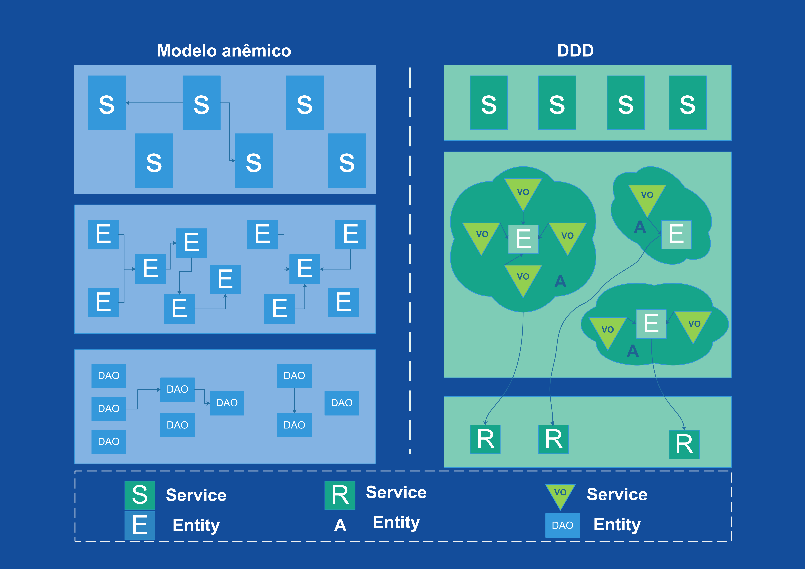

# As vantagens do design controlado por domínio

### Torna a comunicação entre as equipes mais fácil

Em ambientes de desenvolvimento é natural que termos mais técnicos sejam usados para discutir os projetos. Na modelagem DDD, a participação de profissionais de outras áreas é mais frequente, por isso a comunicação entre esses profissionais deve ser simples.

### Aumenta a flexibilidade dos projetos

O modelo DDD é baseado no conceito orientado por análises e design, por isso praticamente tudo dentro do domínio é baseado em um objeto. Isso faz com que o projeto seja mais modular, permitindo a alteração do sistema e a inclusão de novos componentes, de forma regular e contínua.

### Enfatiza a Domain Over Interface

A prática de construir em torno de conceitos e do que é mais aconselhável dentro de um projeto, contribui para que aplicativos mais adequados ao projeto em si. Isso quer dizer que o projeto pode ser mais adequado aos público do domínio.

A implementação de um modelo efetivo de Domain Driven Design pode ser realizada por profissionais de dentro da própria empresa, desde que sejam especialistas ou já tenham realizado esse tipo de implementação em outros projetos.

## Modelos anêmicos

### Modelo orientado a domínio vs. modelo anêmico. Como eles se  diferem?

*Comparação de um aplicativo em camadas comum e um aplicativo com arquitetura DDD.*

### Modelo anêmico e serviços volumosos

O modelo de domínio anêmico nada mais é do que entidades representadas por classes contendo apenas dados e conexões com outras entidades. Essas classes carecem da lógica de negócios, que geralmente é colocada em serviços, utilitários, auxiliares etc. Esse design (três camadas mostradas no lado esquerdo da imagem) é a maneira natural com que modelamos as classes responsáveis ​​por casos de negócios.

Quando implementamos uma funcionalidade específica, primeiro falamos sobre as classes que serão persistidas. Nós os chamamos de entidades. Eles são representados como a letra E no gráfico da imagem acima. Essas entidades são, na verdade, uma representação orientada a objetos para as tabelas do banco de dados. Como resultado, não implementamos nenhuma lógica de negócios dentro deles. Sua única função é ser mapeada por algum ORM para seus equivalentes de banco de dados.

Quando nossas entidades mapeadas estiverem prontas, a próxima etapa é criar classes para lê-las e gravá-las. Acabamos com a camada DAO (Data Access Objects). Normalmente, cada uma de nossas entidades representa um caso de negócios separado, portanto, o número de classes DAO corresponde ao número de entidades. Eles não contêm nenhuma lógica de negócios. As classes DAO nada mais são do que ferramentas para recuperar e persistir entidades. Podemos usar uma estrutura existente para criá-los, ou seja. spring-data com hibernate embaixo.

A última camada, acima do DAO, é a quintessência de nossa implementação - Serviços. Os serviços fazem uso do DAO para implementar a lógica de negócios para funcionalidades específicas. Independentemente do número de funcionalidades, um serviço típico sempre executa as seguintes operações: carrega entidades usando DAO, modifica seu estado de acordo com os requisitos e os persiste. Essa arquitetura foi descrita por Martin Fowler como uma série de Scripts de Transação. Quanto mais complicada a funcionalidade, maior o número de operações entre o carregamento e a persistência. Muitas vezes alguns serviços passam a fazer uso dos outros serviços, resultando em crescimento em toneladas de código, mas apenas nos serviços. Entidades ou DAO permanecem os mesmos, a menos que forneçamos novos campos para persistência.

O DDD vem com uma abordagem totalmente diferente em termos de colocar o código em camadas.

### Modelo rico e serviços limitados

A arquitetura comum com o modelo Domain Driven Design é apresentada no lado direito da imagem.

Observe uma camada de serviços que é muito mais fina do que seu equivalente em um modelo anêmico. O motivo é que a maior parte da lógica de negócios está incluída em agregados, entidades e objetos de valor. Nos serviços colocamos apenas operações trabalhando em muitas áreas do domínio e logicamente não se encaixando em nenhuma delas.Nos serviços colocamos apenas operações trabalhando em muitas áreas do domínio e logicamente não se encaixando em nenhuma delas.

A camada de domínio possui mais tipos de objetos. Existem os Objetos de Valor, as Entidades e os objetos que os montam - os Agregados. Os agregados podem ser conectados apenas por identificadores. Eles não podem compartilhar quaisquer outros dados entre si.

A última camada também é mais fina do que no modelo anterior. O número de repositórios corresponde ao número de agregados em DDD, portanto, o aplicativo com o modelo anêmico tem mais repositórios do que aquele com o modelo rico.

### Mudanças mais fáceis e menos bugs?

A aplicação da arquitetura Domain Driven Design oferece aos desenvolvedores alguns benefícios importantes.

Graças à divisão de objetos nas Entidades e nos Objetos de Valor, podemos gerenciar com mais precisão os objetos recém-criados em nossa aplicação. Os agregados nos permitem encapsular partes de nosso domínio para que nossa API se torne mais simples e as alterações dentro dos agregados sejam mais fáceis de implementar (não precisamos analisar o impacto de nossas alterações em algumas outras partes do domínio porque ele não existe).

Menos número de conexões entre os elementos do domínio reduz o risco de criar um bug durante o desenvolvimento e modificação do código. A representação de domínio estendida torna o código melhor refletindo como os especialistas em domínio descrevem as regras de negócios. Como resultado, muito mais fácil é concluir sobre a correção da solução e, se necessário, alterá-la e desenvolvê-la.

