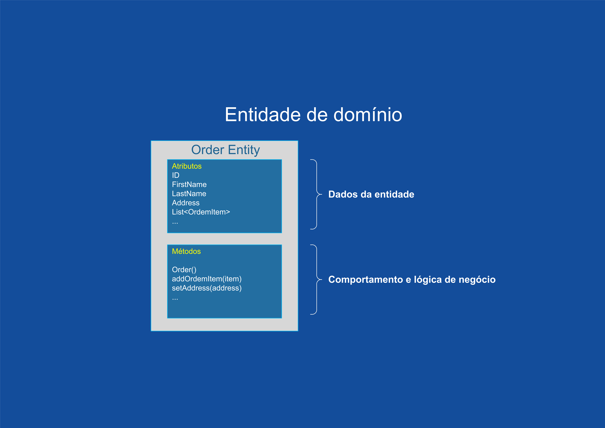
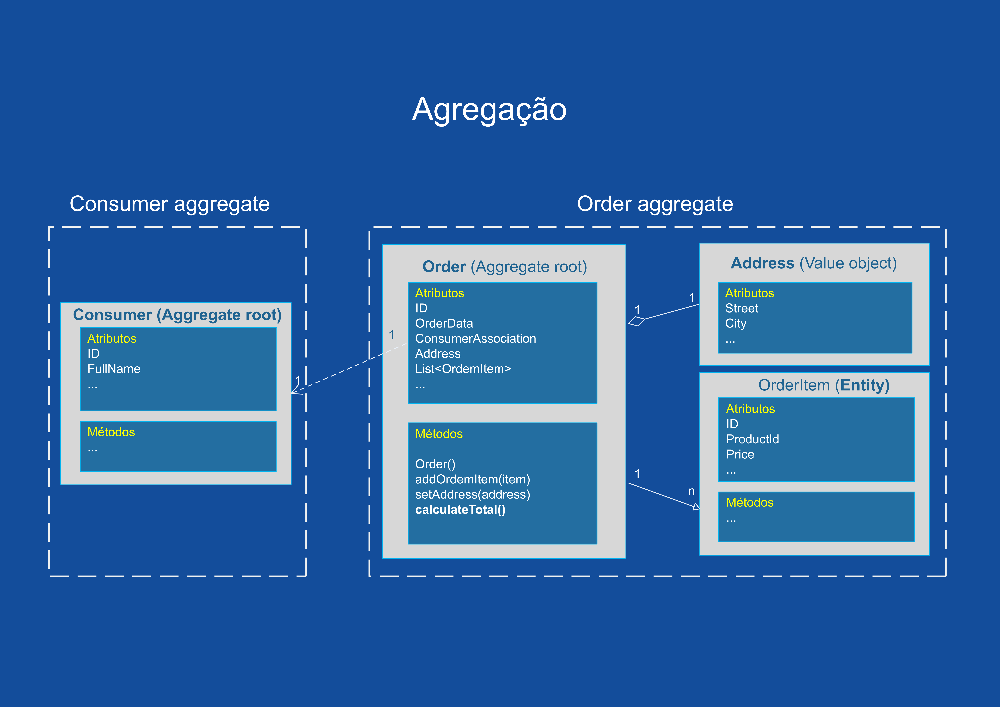

# Design orientado a domínio tático

O foco desta conceitualização é o uso do framework e vamos nos concentrar mais na parte tática do DDD.

DDD tático é um conjunto de padrões de design e blocos de construção que você pode usar para projetar sistemas orientados por domínio. Mesmo para projetos que não são orientados por domínio, você pode se beneficiar do uso de alguns dos padrões DDD táticos.


O foco desta conceituação é o uso do framework e vamos nos concentrar mais na parte tática do DDD.

DDD tático é um conjunto de padrões de design e blocos de construção que você pode usar para projetar sistemas orientados por domínio. Mesmo para projetos que não são orientados por domínio, você pode se beneficiar do uso de alguns dos padrões DDD táticos.

:::info
> **Blocos de construção DDD em java**

>Quando se trata de implementar blocos de construção de DDD, os desenvolvedores geralmente lutam para encontrar um bom equilíbrio entre pureza conceitual e pragmatismo técnico. **Archbase** ajuda a expressar expressar alguns dos conceitos de design tático de DDD no código Java e derivar os metadados para implementar persistência sem poluir o modelo de domínio com anotações por um lado e uma camada de mapeamento adicional no de outros.

>Em aplicativos Java, os **blocos de construção** do Domain-Driven Design podem ser implementados de várias maneiras. Essas maneiras geralmente fazem diferentes compensações ao separar o modelo de domínio real dos aspectos específicos da tecnologia. Muitos projetos Java erram por ainda anotar suas classes de modelo com, por exemplo, anotações JPA para facilitar a persistência, de forma que eles não tenham que manter um modelo de persistência separado. Archbase tem como foco principal tornar o modelo mais focado no DDD, apesar de permitir o uso de forma diferente.
:::

Outro aspecto é como tornar os blocos de construção DDD visíveis dentro do código. Freqüentemente, muitos deles podem ser identificados indiretamente, por exemplo, analisando se o tipo de domínio gerenciado por um repositório Spring Data deve ser um agregado por definição. No entanto, nesse caso específico, estamos contando com uma tecnologia de persistência específica para ser usada para derivar exatamente essa informação. Além disso, seria bom se pudéssemos raciocinar sobre a função de um tipo olhando para ele sem qualquer outro contexto.

Comparado ao design orientado por domínio estratégico, o design tático é muito mais prático e mais próximo do código real. O design estratégico lida com todos abstratos, enquanto o design tático lida com classes e módulos. O objetivo do design tático é refinar o modelo de domínio até um estágio em que possa ser convertido em código funcional.

O design é um processo iterativo e, portanto, faz sentido combinar o design estratégico e o tático. Você começa com o design estratégico, seguido pelo design tático. As maiores revelações e avanços de design de modelo de domínio provavelmente acontecerão durante o design tático e isso, por sua vez, pode afetar o design estratégico e, portanto, você repete o processo.

Objetos de negócio ou de domínio, em DDD, não constituem camadas; ao contrário, eles residem todos na mesma camada, a camada de negócios (naturalmente), geralmente chamada de  **domain**.

As camadas em DDD são:

-   **Interfaces:**  é a interface do sistema com o mundo exterior. Pode ser por exemplo uma interface gráfica com o usuário ou uma fachada de serviços.
-   **Application:**  contém a mecânica do aplicativo, direciona aos objetos de negócio as interações do usuário ou de outros sistemas.
-   **Domain:**  camada onde residem os objetos de negócio (Entities, Value Objects, Aggregations, Services, Factories, Repositories).
-   **Infrastructure:**  oferece suporte às demais camadas, oferecendo por exemplo mapeamento entre objetos de negócio e banco de dados e serviços de acesso a estes bancos de dados.

Vejamos agora os principais conceitos dentro de DDD tático:

### Objetos de valor

Um dos conceitos mais importantes no DDD tático é o **objeto de valor** . Um objeto de valor é um objeto cujo valor é importante. Isso significa que dois objetos de valor com exatamente o mesmo valor podem ser considerados o mesmo objeto de valor e, portanto, são intercambiáveis. Por esse motivo, os objetos de valor sempre devem ser _imutáveis_ . Em vez de alterar o estado do objeto de valor, você o substitui por uma nova instância. Para objetos de valor complexos, considere usar o padrão _construtor_ ou _essência_ .

Objetos de valor não são apenas contêineres de dados - eles também podem conter lógica de negócios. O fato de que os objetos de valor também são imutáveis ​​torna as operações de negócios thread-safe e livres de efeitos colaterais. Este é um dos motivos pelos quais gosto tanto de objetos de valor e por que você deve tentar modelar o máximo possível de seus conceitos de domínio como objetos de valor. Além disso, tente fazer com que os objetos de valor sejam os mais pequenos e coerentes possíveis - isso os torna mais fáceis de manter e reutilizar.

Um bom ponto de partida para criar objetos de valor é pegar todas as propriedades de valor único que tenham um significado comercial e agrupá-las como objetos de valor. Por exemplo:

-   Em vez de usar um `BigDecimal`para valores monetários, use um `Money`objeto de valor que envolve a `BigDecimal`. Se você está lidando com mais de uma moeda, você pode querer criar um `Currency`objeto de valor bem e fazer o seu `Money`objeto embrulhar um `BigDecimal`- `Currency`par.
    
-   Em vez de usar strings para números de telefone e endereços de e-mail, use objetos `PhoneNumber`e `EmailAddress`valor que envolvam strings.    

Usar objetos de valor como esse tem várias vantagens. Em primeiro lugar, eles contextualizam o valor. Você não precisa saber se uma string específica contém um número de telefone, um endereço de e-mail, um nome ou um código postal, nem precisa saber se a `BigDecimal`é um valor monetário, uma porcentagem ou algo completamente diferente. O próprio tipo dirá imediatamente com o que você está lidando.

Em segundo lugar, você pode adicionar todas as operações de negócios que podem ser realizadas em valores de um tipo específico ao próprio objeto de valor. Por exemplo, um `Money`objeto pode conter operações para adicionar e subtrair somas de dinheiro ou calcular percentagens, ao mesmo tempo que garante que a precisão do subjacente `BigDecimal`está sempre correta e que todos os `Money`objetos envolvidos na operação têm a mesma moeda.

Em terceiro lugar, você pode ter certeza de que o objeto de valor sempre contém um valor válido. Por exemplo, você pode validar a string de entrada do endereço de e-mail no construtor do seu `EmailAddress`objeto de valor.

#### Exemplos de código

Um `Money`objeto de valor em Java pode ser parecido com isto:

```java
@DomainValueObject
public class Money implements Serializable, Comparable<Money> {
    private final BigDecimal amount;
    private final Currency currency; // Moeda é um enum ou outro objeto de valor

    public Money(BigDecimal amount, Currency currency) {
        this.currency = Objects.requireNonNull(currency);
        this.amount = Objects.requireNonNull(amount).setScale(currency.getScale(), currency.getRoundingMode());
    }

    public Money add(Money other) {
        assertSameCurrency(other);
        return new Money(amount.add(other.amount), currency);
    }

    public Money subtract(Money other) {
        assertSameCurrency(other);
        return new Money(amount.subtract(other.amount), currency);
    }

    private void assertSameCurrency(Money other) {
        if (!other.currency.equals(this.currency)) {
            throw new IllegalArgumentException("Objetos de dinheiro devem ter a mesma moeda");
        }
    }

    public boolean equals(Object o) {
        // Verifique se a moeda e o valor são iguais
    }

    public int hashCode() {
        // Calcule o código hash com base na moeda e no valor
    }

    public int compareTo(Money other) {          
		// Compare com base na moeda e valor
    }
}
```

Um `StreetAddress`objeto de valor e o construtor correspondente em Java podem ser parecidos com isto (o código não foi testado e algumas implementações de método foram omitidas para maior clareza):

```java
@DomainValueObject
public class StreetAddress implements Serializable, Comparable<StreetAddress> {
    private final String streetAddress;
    private final PostalCode postalCode; // PostalCode é outro objeto de valor
    private final String city;
    private final Country country; // Country é um enum

    public StreetAddress(String streetAddress, PostalCode postalCode, String city, Country country) {
        // Verifique se os parâmetros necessários não são nulos
        // Atribua os valores dos parâmetros aos seus campos correspondentes
    }

    // Getters e possíveis métodos de lógica de negócios omitidos

    public boolean equals(Object o) {
        // Verifique se os campos são iguais
    }

    public int hashCode() {
        // Calcule o código hash com base em todos os campos
    }

    public int compareTo(StreetAddress other) {
         // Compare como quiser
    }

    public static class Builder {

        private String streetAddress;
        private PostalCode postalCode;
        private String city;
        private Country country;

        public Builder() { //Para criar novos StreetAddresses
        }

        public Builder(StreetAddress original) { // Para "modificar" StreetAddresses existentes
            streetAddress = original.streetAddress;
            postalCode = original.postalCode;
            city = original.city;
            country = original.country;
        }

        public Builder withStreetAddress(String streetAddress) {
            this.streetAddress = streetAddress;
            return this;
        }

        // O resto dos métodos 'com ...' omitidos

        public StreetAddress build() {
            return new StreetAddress(streetAddress, postalCode, city, country);
        }
    }
}
```

### Entidades de domínio

As entidades representam objetos de domínio e são definidas principalmente pela identidade, a continuidade e a persistência ao longo do tempo e não apenas pelos atributos que as compõem.  Como Eric Evans diz, "um objeto definido principalmente por sua identidade é chamado de entidade".  As entidades são muito importantes no modelo de domínio, pois elas são a base para um modelo.  Portanto, você deve identificá-las e criá-las com cuidado.

A mesma identidade (ou seja, o mesmo valor  `Id`, embora talvez não a mesma entidade de domínio) pode ser modelada em vários Contextos Limitados ou microsserviços.  No entanto, isso não significa que a mesma entidade, com os mesmos atributos e a mesma lógica, possa ser implementada em vários Contextos Limitados.  Em vez disso, as entidades em cada contexto limitado limitam seus atributos e comportamentos aos necessários no domínio do contexto limitado.

_As entidades de domínio precisam implementar o comportamento, além de implementar os atributos de dados._

Uma entidade de domínio no DDD precisa implementar a lógica do domínio ou o comportamento relacionado aos dados da entidade (o objeto acessado na memória).  Por exemplo, como parte de uma classe de entidade de pedido, você precisa ter a lógica de negócios e as operações implementadas como métodos para tarefas como adicionar um item de pedido, validação de dados e cálculo de total.  Os métodos da entidade cuidam das invariáveis e das regras da entidade, em vez de fazer com que essas regras se espalhem pela camada do aplicativo.



Uma entidade de modelo de domínio implementa comportamentos por meio de métodos, ou seja, não é um modelo "anêmico". Obviamente, também é possível haver entidades que não implementam nenhuma lógica como parte da classe da entidade.  Isso poderá ocorrer em entidades filhas dentro de uma agregação se a entidade filha não tiver nenhuma lógica especial porque a maioria da lógica está definida na raiz da agregação.

#### Exemplo de código
```java
@DomainEntity  
@DomainAggregateRoot  
public class Order implements AggregateRoot<Order, Order.OrderId> {   
  private OrderId id;  
  private MemberAssociation member;  
  private List<OrderItem> orderItems = new ArrayList<>();  
  private DeliveryAssociation delivery;  
  private OrderStatus status;  
  private LocalDateTime orderDate;  
  
  public void addMember(Member member) {  
    this.member = MemberAssociation.of(member.getId());  
  }  
  
  public void addOrderItem(OrderItem orderItem) {  
    orderItems.add(orderItem);  
    orderItem.setOrder(this);  
  }  
  
  public void addDelivery(Delivery delivery) {  
    this.delivery = DeliveryAssociation.of(delivery.getId());  
	delivery.setOrder(OrderAssociation.of(this.getId()));  
  }  
  
  public List<OrderItem> getOrderItems() {  
    return Collections.unmodifiableList(orderItems);  
  }  
  
  public static Order createOrder(Member member, Delivery delivery, OrderItem... orderItems) {  
    Order order = new Order();  
    order.addMember(member);  
    order.addDelivery(delivery);  
    Arrays.stream(orderItems).forEach(oi -> order.addOrderItem(oi));  
    order.setStatus(OrderStatus.ORDER);  
    order.setOrderDate(LocalDateTime.now());  
    return order;  
 }  
 
 public void cancel() {  
    Delivery delivery = this.delivery.load();  
    if (!delivery.isOrderCancelable()) {  
        throw new IllegalStateException("Não é possível cancelar a ordem em : " + delivery.getStatus().name());  
    }  
    setStatus(OrderStatus.CANCEL);  
    getOrderItems().forEach(oi -> oi.cancel());  
 }  
  
 public int getTotalOrderPrice() {  
    return getOrderItems().stream().mapToInt(oi -> oi.getTotalPrice()).sum();  
 }  
  
 @Override  
 public Order getAggregateRoot() {  
    return this;  
 }    
 
 @Override  
 public OrderId getId() {  
    return id;  
 }  
  
  
 public void setId(OrderId id) {  
   this.id = id;  
 }  
  
 public MemberAssociation getMember() {  
   return member;  
 }  
  
 private void setMember(Member member) {  
    this.member = MemberAssociation.of(member.getId());  
 }  
  
 private void setOrderItems(List<OrderItem> orderItems) {  
    this.orderItems = orderItems;  
 }  
  
 public DeliveryAssociation getDelivery() {  
    return delivery;  
 }  
  
 private void setDelivery(DeliveryAssociation delivery) {  
    this.delivery = delivery;  
 }  
  
 public OrderStatus getStatus() {  
   return status;  
 }  
  
 private void setStatus(OrderStatus status) {  
   this.status = status;  
 }  
  
 public LocalDateTime getOrderDate() {  
   return orderDate;  
 }  
  
 private void setOrderDate(LocalDateTime orderDate) {  
   this.orderDate = orderDate;  
 }  
  
  
 @DomainIdentifier  
 public class OrderId<Long> implements Identifier {  
    private Long id;  
    public OrderId() {  
    }  
    public Long getId() {  
      return id;  
    }  
    public void setId(Long id) {  
      this.id = id;  
  }  
 }  
}
```
### Agregações

Um modelo de domínio contém diferentes clusters de entidades de dados e processos que podem controlar uma área significativa de funcionalidades, como inventário ou execução de pedidos.  Uma unidade de DDD mais refinada é a agregação, que descreve um cluster ou o grupo de entidades e os comportamentos que podem ser tratados como uma unidade coesa.

Normalmente, a agregação é definida com base nas transações que são necessárias.  Um exemplo clássico é um pedido que também contém uma lista de itens do pedido.  Geralmente, um item do pedido será uma entidade.  Mas ela será uma entidade filha dentro da agregação de pedido, que também conterá a entidade de pedido como entidade raiz, geralmente chamada de raiz de agregação.

Pode ser difícil identificar agregações.  Uma agregação é um grupo de objetos que precisam ser consistentes em conjunto, mas não basta apenas selecionar um grupo de objetos e rotulá-lo como uma agregação.  Você precisa começar com um conceito de domínio e pensar sobre as entidades que são usadas nas transações mais comuns relacionadas a esse conceito.  As entidades que precisam ser consistentes entre as transações são as que formam uma agregação.  Pensar sobre as operações de transação provavelmente é a melhor maneira de identificar as agregações.

#### Raiz de agregação ou de entidade raiz

Uma agregação é composta por pelo menos uma entidade: a raiz de agregação, também chamada de entidade raiz ou entidade principal.  Além disso, ela pode ter várias entidades filhas e objetos de valor, com todas as entidades e os objetos trabalhando juntos para implementar as transações e os comportamentos necessários.

A finalidade de uma raiz de agregação é garantir a consistência da agregação. Ela deve ser o único ponto de entrada para as atualizações da agregação por meio de métodos ou operações na classe raiz de agregação.  Você deve fazer alterações nas entidades na agregação apenas por meio da raiz de agregação.  É o guardião de consistência da agregação, considerando todas as invariáveis e regras de consistência que você pode precisar obedecer em sua agregação.  Se você alterar uma entidade filha ou um objeto de valor de forma independente, a raiz de agregação não poderá garantir que a agregação esteja em um estado válido.  Isso seria semelhante a uma tabela com um segmento flexível.  Manter a consistência é o principal objetivo da raiz de agregação.




### Repositórios

Repositórios são classes ou componentes que encapsulam a lógica necessária para acessar fontes de dados.  Eles centralizam a funcionalidade comum de acesso a dados, melhorando a sustentabilidade e desacoplando a infraestrutura ou a tecnologia usada para acessar os bancos de dados da camada do modelo de domínio.

O padrão de repositório é uma maneira bem documentada de trabalhar com uma fonte de dados.  No livro  [Padrões de Arquitetura de Aplicações Corporativas](https://www.amazon.com/Patterns-Enterprise-Application-Architecture-Martin/dp/0321127420/), Martin Fowler descreve um repositório da seguinte maneira:

> Um repositório executa as tarefas de um intermediário entre as camadas de modelo de domínio e o mapeamento de dados, funcionando de maneira semelhante a um conjunto de objetos de domínio na memória.  Os objetos de clientes criam consultas de forma declarativa e enviam-nas para os repositórios buscando respostas.  Conceitualmente, um repositório encapsula um conjunto de objetos armazenados no banco de dados e as operações que podem ser executadas neles, fornecendo uma maneira que é mais próxima da camada de persistência.  Os repositórios também oferecem a capacidade de separação, de forma clara e em uma única direção, a dependência entre o domínio de trabalho e a alocação de dados ou o mapeamento.

#### Definir um repositório por agregação

Para cada agregação ou raiz de agregação, você deve criar uma classe de repositório.  Em um microsserviço baseado nos padrões de DDD (Design Orientado por Domínio), o único canal que você deve usar para atualizar o banco de dados são os repositórios.  Isso ocorre porque eles têm uma relação um-para-um com a raiz agregada, que controla as invariáveis da agregação e a consistência transacional.  É possível consultar o banco de dados por outros canais (como ao seguir uma abordagem de CQRS), porque as consultas não alteram o estado do banco de dados.  No entanto, a área transacional (ou seja, as atualizações) sempre precisa ser controlada pelos repositórios e pelas raízes de agregação.

Basicamente, um repositório permite popular na memória dados que são provenientes do banco de dados, em forma de entidades de domínio.  Depois que as entidades estão na memória, elas podem ser alteradas e persistidas novamente no banco de dados por meio de transações.


### Serviços de domínio

Os serviços de domínio implementam a lógica de negócios a partir da definição de um expert de domínio. Trabalham com diversos fluxos de diversas entidades e agregações, utilizam os repositórios como interface de acesso aos dados e consomem recursos da camada de infraestrutura, como: enviar email, disparar eventos, entre outros.

### Eventos de domínio

Até agora, vimos apenas as "coisas" no modelo de domínio. No entanto, elas só podem ser usadas para descrever o estado estático em que o modelo está em um determinado momento. Em muitos modelos de negócios, você também precisa ser capaz de descrever coisas que acontecem e alterar o estado do modelo. Para isso, você pode usar eventos de domínio.

Os eventos de domínio não foram incluídos no livro de Evans sobre design orientado a domínio. Eles foram adicionados à caixa de ferramentas posteriormente e estão incluídos no livro de Vernon.

Um evento de domínio é tudo o que acontece no modelo de domínio que pode ser de interesse para outras partes do sistema. Os eventos de domínio podem ser de baixa granularidade (por exemplo, uma raiz de agregação específica é criada ou um processo é iniciado) ou de baixa granulação (por exemplo, um determinado atributo de uma determinada raiz agregada é alterado).

Os eventos de domínio geralmente têm as seguintes características:


 - Eles são imutáveis ​​(afinal, você não pode mudar o passado).
 - Eles têm um carimbo de data / hora quando o evento em questão ocorreu.
 - Eles podem ter um ID único que ajuda a distinguir um evento de outro, dependendo do tipo de evento e de como os eventos são distribuídos.
 - Eles são publicados por raízes agregadas ou serviços de domínio (mais sobre isso mais tarde).

Depois que um evento de domínio é publicado, ele pode ser recebido por um ou mais ouvintes de eventos de domínio que, por sua vez, podem acionar processamento adicional e novos eventos de domínio, etc. O editor não está ciente do que acontece com o evento, nem deve ser capaz de afetar o editor (em outras palavras, publicar eventos de domínio deve ser livre de efeitos colaterais do ponto de vista do editor). Por isso, é recomendado que ouvintes de evento de domínio não sejam executados dentro da mesma transação que publicou o evento.

Do ponto de vista do design, a maior vantagem dos eventos de domínio é que eles tornam o sistema extensível. Você pode adicionar quantos ouvintes de eventos de domínio precisar para acionar uma nova lógica de negócios sem ter que alterar o código existente. Isso naturalmente pressupõe o correto eventos são publicados em primeiro lugar. Alguns eventos você pode saber antecipadamente, mas outros se revelarão mais adiante. Você pode, é claro, tentar adivinhar quais tipos de eventos serão necessários e adicioná-los ao seu modelo, mas também corre o risco de entupir o sistema com eventos de domínio que não são usados ​​em lugar nenhum. Uma abordagem melhor é tornar o mais fácil possível a publicação de eventos de domínio e adicionar os eventos ausentes quando perceber que precisa deles.


>**Uma nota sobre Event Source**
Event Source é um padrão de design em que o estado de um sistema é persistido como um log de eventos ordenados. Cada um altera o estado do sistema e o estado atual pode ser calculado a qualquer momento reproduzindo o log de eventos do início ao fim. O padrão é especialmente útil em aplicativos como controles financeiros ou registros médicos em que o histórico é tão importante (ou até mais importante) que o estado atual.


### Validação em DDD

A validação é um assunto amplo porque prevalece em todas as áreas de um aplicativo. A validação é difícil de implementar na prática porque deve ser implementada em todas as áreas de um aplicativo, normalmente empregando métodos diferentes para cada área. Em um sentido geral, a validação é um mecanismo para garantir que as operações resultem em estados válidos. A ambigüidade nessa declaração não deve ser negligenciada porque ela ilustra várias características importantes de validação. Uma característica é o contexto - o contexto sob o qual a validação é chamada.

#### Sempre Válido

No design orientado por domínio, existem duas escolas de pensamento sobre validação que giram em torno da noção da [entidade](http://domaindrivendesign.org/node/109) sempre válida . Jeffrey Palermo [propõe](http://jeffreypalermo.com/blog/the-fallacy-of-the-always-valid-entity/) que a entidade sempre válida é uma falácia. Ele sugere que a lógica de validação deve ser desacoplada da entidade, o que adiaria a determinação das regras de validação a serem invocadas até o tempo de execução. A outra escola de pensamento, [apoiada](http://codebetter.com/gregyoung/2009/05/22/always-valid/) por Greg Young e outros, afirma que as entidades devem ser sempre válidas.
