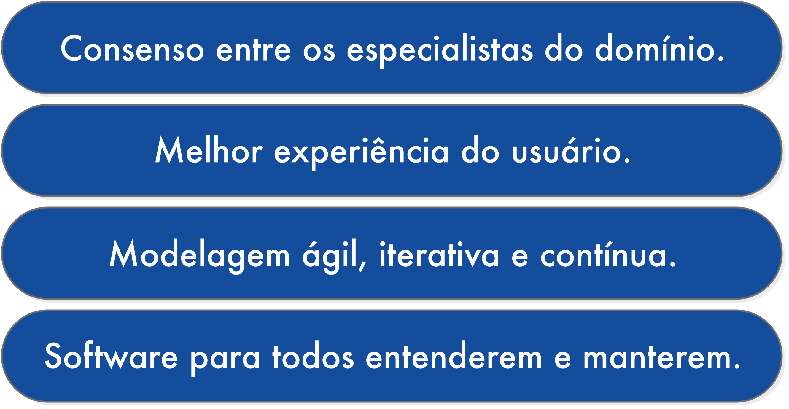
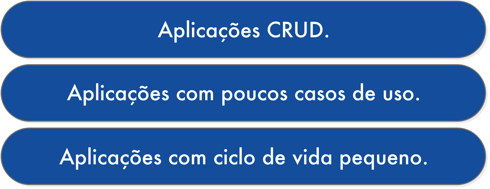

# Introdução

Domain-driven Design (**DDD**) ou desenvolvimento dirigido ao domínio é um conjunto de padrões e princípios usados para ajudar no desenvolvimento de aplicações que vão influenciar na melhor compreensão e uso do projeto. É visto como uma nova maneira de pensar sobre a metodologia de desenvolvimento.

O desenvolvimento de um software é feito com base nos objetivos do cliente. Porém, na hora de escrever o código e durante todo o projeto, existe o risco de não atingir a expectativa. Diversos fatores podem ocasionar esse problema, entre eles as falhas de comunicação, a pressa em entregar o projeto, entre outros.

Nenhum projeto deve ser iniciado até que todas as necessidades do domínio estejam definidas, alinhadas e com suas devidas soluções apresentadas. O  Domain-driven Design (**DDD**) é uma metodologia que visa garantir que as aplicações serão construídas para atender as necessidades do domínio.

A ideia básica do **DDD** está centrada no conhecimento do problema para o qual o software foi proposto. Na prática, trata-se de uma coleção de padrões e princípios de design que buscam auxiliar o desenvolvedor na tarefa de construir aplicações que reflitam um entendimento do negócio. É a construção do software a partir da modelagem do domínio real como classes de domínio que, por sua vez, possuirão relacionamentos entre elas.

**A fundação de DDD está no conceito de linguagem onipresente** (_ubiquitous language_, no original). Não está em determinar o que é uma entidade, objeto de valor, agregado, serviço ou repositório.

## Principais conceitos do DDD

-   `Ubiquitous Language`: É uma linguagem que deve ser comum entre o "Cliente" e o "Desenvolvedor". Seu código deve expressar as terminologias do do cliente, para que os desenvolvedores e o cliente falem a mesma lingua.
-   `Bounded Context`: Criar delimitações específicas entre cada parte do sistema. Uma classe Produto não tem o mesmo sentido num contexto de "Suporte" do que num contexto de "Venda". Essa "Separação" de sentido entre contextos DEVE SER CLARA!
-   `Core Domain`: Foca no principal problema à ser resolvido. Detalhes menores, podem ser delegados ou integrados com soluções de terceiros que já estão prontas. O importante é FOCAR SEMPRE NO NEGÓCIO.

## DDD não é arquitetura em camadas

O DDD é uma abordagem de modelagem de software que segue um conjunto de práticas com objetivo de facilitar a implementação de complexas regras / processos de negócios que tratamos como **domínio**.

O DDD não é uma receita pronta sobre como desenvolver uma arquitetura baseada em Presentation, Services, Application, Domain e Infra.

O DDD pode ser aplicado para resolver problemas de dominio de negócio dentro de uma arquitetura de uma aplicação com certeza.

## Porque usar DDD?

## Vale a pena usar DDD?

Claro que a resposta é: **depende!**

**DDD** não é uma bala de prata. Para um aplicativo **CRUD** simples ou com pouca lógica de negócios, pode ser um exagero. Assim que seu aplicativo se tornar grande, vale a pena considerar o **DDD**. Apontando mais uma vez para os principais benefícios que você pode obter usando **DDD**:  
melhor expressão da lógica de negócios em objetos de domínio por meio de métodos significativos. Os objetos de domínio delimitam os limites da transação manipulando apenas seus internos, o que simplifica a implementação da lógica de negócios e não aumenta seu gráfico de objetos de domínio conectados  estrutura de pacotes muito simples, melhor separação entre domínio e mecanismo de persistência.

## Quando não utilizar DDD

