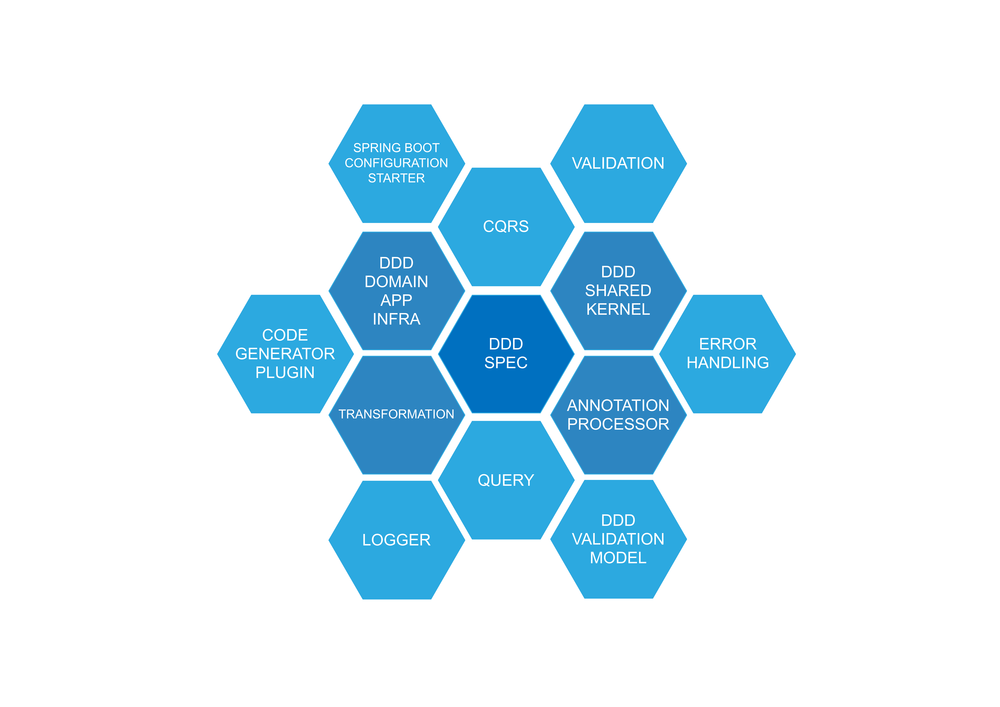

# Introdução

Archabase é um framework para aplicações java e foi desenvolvido visando facilitar o desenvolvimento de projetos sejam eles monolitos ou micro serviços. Os módulos foram criados para facilitar o trabalho de desenvolvimento e permitem tanto o uso para aplicações simples com modelos anêmicos, CRUD's, bem como como aplicações mais complexas usando os conceitos de DDD (Domain Driven Design) de forma ágil e bem estruturada. Traz suporte para arquiteturas de sofware como Clean Architecture e Ports and Adapters (Hexagonal Architecture).

## Módulos do framework

## Conceitualização

Antes de falarmos de cada módulo desenvolvido e sua reponsabilidade dentro do contexto do framework vamos conceituar alguns pontos importantes que fazem parte da vida dos desenvolvedores e quem rendem muitas dúvidas no dia a dia e os quais procuramos desenvolver soluções para ajudar a resolver.

