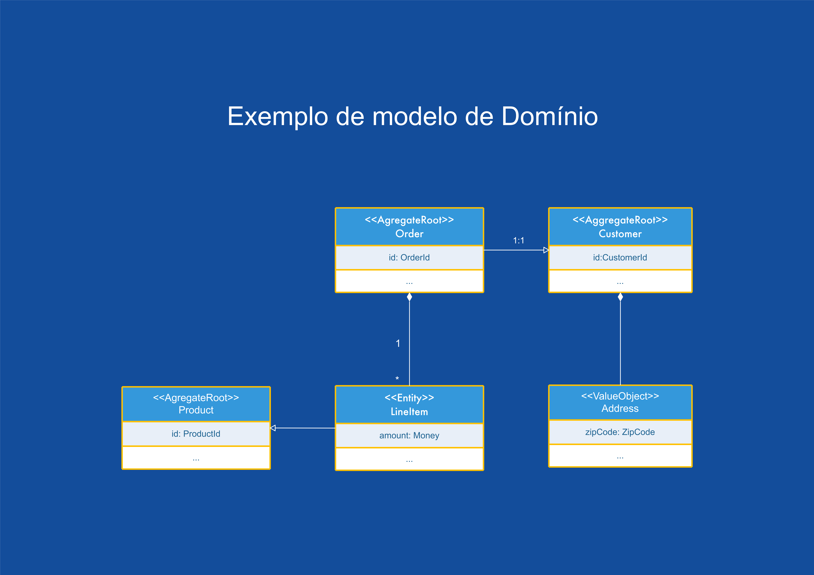

# Módulos que compõem o Archbase

### archbase-domain-driven-design-spec

Este módulo é o coração do framework pois fornece todos os contratos, anotações e especificações necessárias a serem seguidas para a implementação de um projeto java seguindo os conceitos de DDD.

Vejamos os principais **contratos**:

#### Objetos de valor
```java
public interface ValueObject extends Serializable
```
Interface para marcação de quais objetos são ValueObject. A principal caracteristica
desses objetos é serem imutáveis. Devem ser usados em entidades para enriquecer o domínio.


#### Identificadores
```java
public interface Identifier {
```
**Identifier** é apenas uma interface de marcação para equipar os tipos de identificadores. Isso encoraja tipos dedicados  a descrever identificadores. A intenção principal disso é evitar que cada entidade seja identificada por um tipo comum  (como **Long** ou **UUID**). Embora possa parecer uma boa ideia do ponto de vista da persistência, é fácil misturar um  **identificador** de uma Entidade com o identificador de outra. Os tipos de identificadores explícitos evitam esse problema.

#### Identificáveis
```java
public interface Identifiable<ID>
```
>**Identifiable** é uma interface de marcação para informar que determinados tipos como por exemplo Entidades são identificáveis.  Com isso garantem que associações sejam feitas apenas com objetos identificáveis.

#### Entidades
```java
public interface Entity<T extends AggregateRoot<T, ?>, ID> extends Identifiable<ID> {  
    public T getAggregateRoot();  
}
```
>Identifica um o objeto como sendo uma Entidade que possui uma identidade, passando por um ciclo de vida,  embora seus atributos possam mudar. Os meios de identificação podem vir de fora ou podem ser arbitrários  identificador criado por e para o sistema, mas deve corresponder às distinções de identidade no modelo. O modelo deve definir o que significa ser a mesma coisa.  
Ela também está vinculado a um AggregateRoot. Isso pode parecer contra-intuitivo à primeira vista,  mas permite verificar que uma Entity não é acidentalmente referido a partir de um agregado diferente.  
Usando essas interfaces, foi criado o módulo **archbase-validation-ddd-model** para fazer a análise do código estático para verificar a  estrutura do nosso modelo.


#### Agregadores
```java
public interface AggregateRoot<T extends AggregateRoot<T, ID>, ID extends Identifier> extends Entity<T, ID> {
```
>Identifica uma raiz agregada, ou seja, a entidade raiz de um agregado. Um agregado forma um cluster de regras consistentes geralmente formado em torno de um conjunto de entidades, definindo invariantes com base nas propriedades do agregado que devem  ser encontrado antes e depois das operações dele. 
Os agregados geralmente se referem a outros agregados por seu identificador.  Referências a agregados internos devem ser evitadas e, pelo menos, não consideradas fortemente consistentes (ou seja, uma referência  retido pode ter desaparecido ou se tornar inválido a qualquer momento). Eles também atuam como escopo de consistência,   ou seja, as mudanças em um único agregado devem ser fortemente consistentes, enquanto as mudanças em vários outros devem  ser apenas consistência eventual.

#### Associação
```java
public interface Association<T extends AggregateRoot<T, ID>, ID extends Identifier> extends Identifiable<ID> {  
    public T load();   
}
```

>É basicamente uma indireção em direção a um identificador de agregado relacionado que serve puramente  à expressividade dentro do modelo.

#### Repositórios
```java
public interface Repository<T,ID,N extends Number & Comparable<N>> extends QuerydslPredicateExecutor<T>, PagingAndSortingRepository<T, ID>,  
  RevisionRepository<T,ID,N> {  
  
 /**  
 * Recupera todas as entidades * @return Lista de entidades  
 */  
 List<T> findAll();  
  
  /**  
 * Recupera todas as entidades com ordenação. * @param sort ordenação  
 * @return Lista de entidades  
 */  
 List<T> findAll(Sort sort);  
  
 /**  
 * Recupera todas as entidades de estão na lista de ID's * passadas como parâmetro.     * @param ids Lista de ID's  
 * @return Lista de entidades  
 */  
 List<T> findAllById(Iterable<ID> ids);  
  
 /**  
 * Salva uma lista de entidades * @param entities Entidades para salvar  
 * @param <S> Tipo de entidade  
 * @return Lista de entidades salvas.  
 */  
 <S extends T> List<S> saveAll(Iterable<S> entities);  
  
 /**  
 * Libera todas as alterações pendentes no banco de dados. 
 */  
 void flush();  
  
 /**  
 * Salva uma entidade e elimina as alterações instantaneamente. * * @param entity  
 * @return a entidade salva  
 */  
 <S extends T> S saveAndFlush(S entity);  
  
 /**  
 * Exclui as entidades fornecidas em um lote, o que significa que criará um único comando. * * @param entities  
 */  
 void deleteInBatch(Iterable<T> entities);  
  
 /**  
 * Exclui todas as entidades em uma chamada em lote. 
 */  
 void deleteAllInBatch();  
 
 /**  
 * Retorna uma referência à entidade com o identificador fornecido. * * @param id não deve ser {@literal null}.  
 * @return uma referência à entidade com o identificador fornecido.  
 * */  
 T getOne(ID id);  
  
 /**  
 * Salva uma lista de entidades * @param iterable Lista de entidades  
 * @return Lista de entidades salvas  
 */  
 List<T> save(T... iterable);  
  
 /**  
 * Recupera todas as entidades que atendam o predicado. * @param predicate Predicado.  
 * @return Lista de entidades  
 */  @Override  
 List<T> findAll(Predicate predicate);  
  
  /**  
 * Recupera todas as entidades que atendam o predicado e retorna * de forma ordenada. * @param predicate Predicado  
 * @param sort Ordenação  
 * @return Lista de entidades ordenada.  
 */  @Override  
  List<T> findAll(Predicate predicate, Sort sort);  
  
 /**  
 * Recupera todas as entidades que atendam o predicado e retorna * de forma ordenada. * @param predicate  
 * @param orderSpecifiers  
 * @return Lista de entidades ordenada.  
 */  @Override  
  List<T> findAll(Predicate predicate, OrderSpecifier<?>... orderSpecifiers);  
  
 /**  
 * Recupera todas as entidades de forma ordenada. * @param orderSpecifiers Ordenação  
 * @return Lista de entidades ordenadas  
 */  @Override  
  List<T> findAll(OrderSpecifier<?>... orderSpecifiers);  
  
 /**  
 * Recupera todas as entidades que correspondem a uma especificação. * @param archbaseSpecification  
 * @return lista de entidades  
 */  
 List<T> matching(ArchbaseSpecification<T> archbaseSpecification);  
  
 /**  
 * Conte quantas entidades correspondem a uma especificação. * @param archbaseSpecification  
 * @return quantidade de entidades  
 */  
 Long howMany(ArchbaseSpecification<T> archbaseSpecification);  
  
 /**  
 * Determine se alguma de nossas entidades corresponde a uma especificação. * @param archbaseSpecification  
 * @return true se alguma atende  
 */  
 Boolean containsAny(ArchbaseSpecification<T> archbaseSpecification);  
  
 /**  
 * Recupera todos os objetos que atendam ao filtro * @param Filter Filtro  
 * @param pageable Configuração de página  
 * @return Página  
 */  
 Page<T> findAll(String Filter, Pageable pageable);  
}
```

>Repositórios são classes ou componentes que encapsulam a lógica necessária para acessar fontes de dados.  Eles centralizam a funcionalidade comum de acesso a dados, melhorando a sustentabilidade e desacoplando a  infraestrutura ou a tecnologia usada para acessar os bancos de dados da camada do modelo de domínio.  

>Um repositório executa as tarefas de um intermediário entre as camadas de modelo de domínio e o mapeamento  de dados, funcionando de maneira semelhante a um conjunto de objetos de domínio na memória. Os objetos de  clientes criam consultas de forma declarativa e enviam-nas para os repositórios buscando respostas.  

>Conceitualmente, um repositório encapsula um conjunto de objetos armazenados no banco de dados e as operações  que podem ser executadas neles, fornecendo uma maneira que é mais próxima da camada de persistência.  
Os repositórios também oferecem a capacidade de separação, de forma clara e em uma única direção, a dependência  entre o domínio de trabalho e a alocação de dados ou o mapeamento.

#### Serviços
```java
public interface Service<T,ID, N extends Number & Comparable<N>> {  
    public Repository<T,ID,N> getRepository();   
}
```
>Os serviços de domínio implementam a lógica de negócios a partir da definição de um expert de domínio.  Trabalham com diversos fluxos de diversas entidades e agregações, utilizam os repositórios como interface de acesso aos dados e consomem recursos da camada de infraestrutura, como: enviar email, disparar eventos,  entre outros.

Os serviços se subdividem em dois contratos quando aplicados junto como o padrão CQRS, ficando desta forma:

**CommandService**
```java
public interface CommandService<T,ID, N extends Number & Comparable<N>> extends Service<T,ID,N> {  
}
```
**QueryService**
```java
public interface QueryService<T,ID, N extends Number & Comparable<N>> extends Service<T,ID,N> {   
}
```

#### Fábricas


#### Anotações

Anotações criadas para auxiliar na demarcação do contexto e identificação das classes dentro do conceito de DDD, isto serve tanto para o framework para transformação, geração e validação de código como para ser utilizando para criação de uma documentação mais rica.

 - **DomainAggregateRoot**: Identifica uma raiz agregada, ou seja, a entidade raiz de um agregado.
 - **DomainAssociation**: Identifica uma associação entre duas entidades dentro do modelo.
 - **DomainBoundedContext**: Identifica um contexto limitado. Uma descrição de um limite (normalmente um subsistema ou o trabalho de uma equipe específica)  dentro do qual um determinado modelo é definido e aplicável. Um contexto limitado tem um estilo arquitetônico e contém  lógica de domínio e lógica técnica.
 - **DomainEntity**: Identifica uma Entidade de domínio que pode ser também um Agregador.
 - **DomainFactory**: Identifica uma Fábrica. As fábricas encapsulam a responsabilidade de criar objetos complexos em geral e  Agregados em particular. Os objetos retornados pelos métodos de fábrica têm a garantia de estar em estado válido.
 - **DomainIdentifier**: Identifica um classe com papel de Identificador de entidade. Identificadores são parte das Entidades de dominio. Para que elas  possam ser identificáveis precisam estar marcadas com a interface **Identifier**.  Usamos esta anotação para documentações e geração de código também.
 - **DomainModule**:  Identifica um módulo DDD. Pode ser usado para criar documentação.
 - **DomainRepository**:Identifica um Repositório de domínio. Repositórios simulam uma coleção de agregados para os quais as instâncias agregadas podem ser  adicionados, atualizadas e removidos.
 - **DomainService**: Identifica um serviço de domínio.
 - **DomainTransient**: Marca um campo de Entidade de dominio como transient(temporário).
 - **DomainValueObject** Identifica um objeto de valor.

**Contextualizando os desafios:**

Comecemos com um exemplo rápido que nos permite destacar os desafios. Observe que o modelo não é a única maneira de projetá-lo. Estamos apenas descrevendo o que poderia ser o resultado de um projeto em um determinado contexto. É sobre como um agregado, entidade ou objeto de valor pode ser representado em código e o efeito de uma maneira particular de fazer isso. Modelamos `Customer`s que consistem em `Address`es, `Order`s que consistem em `LineItem`s que, por sua vez, apontam para `Product`s e apontam para o `Customer`que fez o pedido. Ambos `Customer`e `Order`são agregados conceitualmente.




Vamos começar com o `Order`relacionamento de `Customer` agregado. Uma representação muito ingênua no código que usa anotações JPA diretamente provavelmente seria algo assim:

```java
@Entity
class Order {
  @EmbeddedId OrderId id;
  @ManyToOne Customer customer;
  @OneToMany List<LineItem> items;
}

@Entity
class LineItem {
  @ManyToOne Product product.
}

@Entity
class Customer {
  @EmbeddedId CustomerId id;
}
```
Embora isso constitua um código funcional, grande parte da semântica do modelo permanece implícita. No JPA, o conceito de granulação mais grosseira é uma entidade. Não sabe sobre agregados. Ele também usará automaticamente o carregamento antecipado para relacionamentos com um. Para uma relação de agregação cruzada, não é isso que queremos.

Uma reação focada na tecnologia seria mudar para o carregamento lento. No entanto, isso cria novos problemas, estamos começando a cavar uma toca de coelho e, na verdade, mudamos da modelagem de domínio para a tecnologia de modelagem, algo que queríamos evitar em primeiro lugar. Também podemos querer recorrer apenas a identificadores de mapa em vez de tipos de agregação, por exemplo, substituindo `Customer`por `CustomerId`in `Order`. Embora isso resolva o problema de cascata, agora é ainda menos claro que essa propriedade estabelece efetivamente uma relação de agregação cruzada.

Para os `LineItem` referenciados, um mapeamento padrão adequado seria mais rápido (em vez de preguiçoso) e cascateamento de todas as operações, pois o agregado geralmente governa o ciclo de vida de seus internos.

Para melhorar a situação descrita acima, poderíamos começar introduzindo tipos que nos permitem atribuir funções explicitamente para modelar artefatos e restringir a composição deles usando genéricos. Vejamos como a idéia a qual **archbase** implementa:

```java
interface Identifier {}

interface Identifiable<ID extends Identifier> {
  ID getId();
}

interface Entity<T extends AggregateRoot<T, ?>, ID extends Identifier>
  extends Identifiable<ID> {}

interface AggregateRoot<T extends AggregateRoot<T, ID>, ID extends Identifier>
  extends Entity<T, ID> {}

interface Association<T extends AggregateRoot<T, ID>, ID extends Identifier>
  extends Identifiable<ID> {}
```

`Identifier`é apenas uma interface de marcador para equipar os tipos de identificadores. Isso encoraja tipos dedicados a descrever identificadores. A intenção principal disso é evitar que cada entidade seja identificada por um tipo comum (como `Long`ou `UUID`). Embora possa parecer uma boa ideia do ponto de vista da persistência, é fácil misturar um `Customer`identificador de com `Order`um de. Os tipos de identificadores explícitos evitam esse problema.

Um DDD `Entity`é um conceito identificável, o que significa que ele precisa expor seu identificador. Ele também está vinculado a um `AggregateRoot`. Isso pode parecer contra-intuitivo à primeira vista, mas permite verificar que `Entity`tal como `LineItem`não é acidentalmente referido a partir de um agregado diferente. Usando essas interfaces, podemos configurar ferramentas de análise de código estático para verificar a estrutura do nosso modelo.

`Association` é basicamente uma indireção em direção a um identificador de agregado relacionado que serve puramente à expressividade dentro do modelo.

Blocos de construção explícitos em nosso exemplo:
```java
class OrderId implements Identifier {} 

class Order implements AggregateRoot<Order, OrderId> {
  OrderId id;
  CustomerAssociation customer;
  List<LineItem> items;
}

class LineItem implements Entity<Order, LineItemId> { … }

class CustomerAssociation implements Association<Customer, CustomerId> { … }

class Customer implements AggregateRoot<Customer, CustomerId> { … }
```

Com isso, podemos extrair muitas informações adicionais observando apenas os tipos e os campos:

-   O tipo de identificador para `Order`é `OrderId`, algo que poderíamos ter derivado antes, mas envolvendo apenas a interpretação de anotação JPA.
-   `LineItem`é uma entidade pertencente ao `Order`agregado.
-   A `customer`propriedade indica claramente que representa uma associação com o `Customer`agregado.

### archbase-domain-driven-design

### archbase-shared-kernel

### archbase-transformation

Plugin para aplicar as anotações de persistência do metamodel nas entidades e agregados.  

Isso foi uma técnica usada para não poluir as classes do dominio com anotações de persistência e  eliminar o acoplamento. Para trocar a forma de persistência basta apenas criar um novo  metamodel para o formato desejado e escrever um novo plugin.  Desta formas as entidades do domínio podem ser transformadas para persistir o formato que desejarmos.

### archbase-annotation-processor

### archbase-cqrs

### archbase-query

Os repositórios possuem um alto grau de flexibilidade para a criação de filtros usando predicados, consultas nativas, query by Example, specification, etc. Porém isso faz parte de uma série de recursos de uso interno da api para manipulação das entidades dentro dos serviços. Isso não é possível de ser utilizado pelos consumidores da api, no caso desenvolvimento do frontend, integradores, etc.

Com isso somos obrigados a criar filtros específicos para atender as demandas dos consumidores da api. Isso gera um número de atividades que poderíamos evitar. Em alguns casos realmente é preciso criar novos métodos para atender alguns consumidores, mas quando por exemplo os consumidores da api somos nós mesmos criando nossos produtos poderíamos criar formas de dar mais flexibilidade aos desenvolvedores do frontend ou os que iram necessitar acessar os serviços.

Pensando desta forma precisamos estabelecer uma forma segura que os consumidores possam fazer chamadas ao serviços usando para isto uma forma realizar o filtro dos dados. 

#### RSQL
RSQL é uma linguagem de consulta para filtragem parametrizada de entradas em APIs RESTful. Este padrão foi criado baseado no FIQL (Feed Item Query Language).  RSQL fornece uma sintaxe amigável e de fácil entendimento para a criação de filtros.
##### Gramática e semântica
_A seguinte especificação de gramática foi escrita em notação EBNF ( [ISO 14977](http://www.cl.cam.ac.uk/~mgk25/iso-14977.pdf) )._

A expressão RSQL é composta por uma ou mais comparações, relacionadas entre si com operadores lógicos:
-   Logical AND :  `;`  or  `and`
-   Logical OR :  `,`  or  `or`

Por padrão, o operador AND tem precedência (ou seja, é avaliado antes de qualquer operador OR). No entanto, uma expressão entre parênteses pode ser usada para alterar a precedência, produzindo o que quer que a expressão contida produza.

```properties
input          = or, EOF;
or             = and, { "," , and };
and            = constraint, { ";" , constraint };
constraint     = ( group | comparison );
group          = "(", or, ")";
```
A comparação é composta por um seletor, um operador e um argumento.
```
comparison     = selector, comparison-op, arguments;
```
O seletor identifica um campo (ou atributo, elemento, ...) da representação do recurso pelo qual filtrar. Pode ser qualquer string Unicode não vazia que não contenha caracteres reservados (veja abaixo) ou um espaço em branco. A sintaxe específica do seletor não é imposta por este analisador.
```
selector       = unreserved-str;
```
Operadores de comparação:
-   Equal to :  `==`    
-   Not equal to :  `!=`    
-   Less than :  `=lt=`  or  `<`    
-   Less than or equal to :  `=le=`  or  `⇐`    
-   Greater than operator :  `=gt=`  or  `>`    
-   Greater than or equal to :  `=ge=`  or  `>=`    
-   In :  `=in=`    
-   Not in :  `=out=`
- 
O argumento pode ser um único valor ou vários valores entre parênteses separados por vírgula. O valor que não contém nenhum caractere reservado ou um espaço em branco pode ficar sem aspas; outros argumentos devem ser colocados entre aspas simples ou duplas.
```properties
arguments      = ( "(", value, { "," , value }, ")" ) | value;
value          = unreserved-str | double-quoted | single-quoted;

unreserved-str = unreserved, { unreserved }
single-quoted  = "'", { ( escaped | all-chars - ( "'" | "\" ) ) }, "'";
double-quoted  = '"', { ( escaped | all-chars - ( '"' | "\" ) ) }, '"';

reserved       = '"' | "'" | "(" | ")" | ";" | "," | "=" | "!" | "~" | "<" | ">";
unreserved     = all-chars - reserved - " ";
escaped        = "\", all-chars;
all-chars      = ? all unicode characters ?;
```
Se precisar usar aspas simples e duplas dentro de um argumento entre aspas, você deve escapar uma delas usando `\`(barra invertida). Se você quiser usar `\`literalmente, dobre como `\\`. A barra invertida tem um significado especial apenas dentro de um argumento entre aspas, e não em um argumento sem aspas.

#####  Como adicionar operadores personalizados
Caso haja a necessidade de criarmos mais operadores podemos fazer isto da seguinte forma:
```java
Set<ComparisonOperator> operators = RSQLOperators.defaultOperators();
operators.add(new ComparisonOperator("=all=", true));
Node rootNode = new RSQLParser(operators).parse("genres=all=('thriller','sci-fi')");
```

#### Integração JPA e Querydsl

Para que o filtro seja usado pelo consumidor com base na sintaxe RSQL o que é bem simples é necessário que possamos fazer a tradução do mesmo para os formatos usados nos repositórios como: JPA Specification e QueryDsl Predicate.

Para isso foram criadas duas classes para dar suporte a essa tradução:

|Classe|Descrição  |
|--|--|
| br.com.archbase.query.rsql.jpa.**ArchbaseRSQLJPASupport** | Converte filtro no formato RSQL para JPA Specification. |
| br.com.archbase.query.rsql.querydsl.**ArchbaseRSQLQueryDslSupport** | Converte filtro no formato RSQL para QueryDsl Predicate. |

#### Sintaxe RSQL para uso com JPA e Querydsl:
```properties
filtro = "id=bt=(2,4)";// id>=2 && id<=4 //between
filtro = "id=nb=(2,4)";// id<2 || id>4 //not between
filtro = "empresa.nome=like=em"; //like %em%
filtro = "empresa.nome=ilike=EM"; //ignore case like %EM%
filtro = "empresa.nome=icase=EM"; //ignore case equal EM
filtro = "empresa.nome=notlike=em"; //not like %em%
filtro = "empresa.nome=inotlike=EM"; //ignore case not like %EM%
filtro = "empresa.nome=ke=e*m"; //like %e*m%
filtro = "empresa.nome=ik=E*M"; //ignore case like %E*M%
filtro = "empresa.nome=nk=e*m"; //not like %e*m%
filtro = "empresa.nome=ni=E*M"; //ignore case not like %E*M%
filtro = "empresa.nome=ic=E^^M"; //ignore case equal E^^M
filtro = "empresa.nome==demo"; //equal
filtro = "empresa.nome=='demo'"; //equal
filtro = "empresa.nome==''"; //equal to empty string
filtro = "empresa.nome==dem*"; //like dem%
filtro = "empresa.nome==*emo"; //like %emo
filtro = "empresa.nome==*em*"; //like %em%
filtro = "empresa.nome==^EM"; //ignore case equal EM
filtro = "empresa.nome==^*EM*"; //ignore case like %EM%
filtro = "empresa.nome=='^*EM*'"; //ignore case like %EM%
filtro = "empresa.nome!=demo"; //not equal
filtro = "empresa.nome=in=(*)"; //equal to *
filtro = "empresa.nome=in=(^)"; //equal to ^
filtro = "empresa.nome=in=(demo,real)"; //in
filtro = "empresa.nome=out=(demo,real)"; //not in
filtro = "empresa.id=gt=100"; //greater than
filtro = "empresa.id=lt=100"; //less than
filtro = "empresa.id=ge=100"; //greater than or equal
filtro = "empresa.id=le=100"; //less than or equal
filtro = "empresa.id>100"; //greater than
filtro = "empresa.id<100"; //less than
filtro = "empresa.id>=100"; //greater than or equal
filtro = "empresa.id<=100"; //less than or equal
filtro = "empresa.nome=isnull=''"; //is null
filtro = "empresa.nome=null=''"; //is null
filtro = "empresa.nome=na=''"; //is null
filtro = "empresa.nome=nn=''"; //is not null
filtro = "empresa.nome=notnull=''"; //is not null
filtro = "empresa.nome=isnotnull=''"; //is not null
filtro = "empresa.nome=='demo';empresa.id>100"; //and
filtro = "empresa.nome=='demo' and empresa.id>100"; //and
filtro = "empresa.nome=='demo',empresa.id>100"; //or
filtro = "empresa.nome=='demo' or empresa.id>100"; //or
```
Usando filtro RSQL com JPA Specification:
```java
Pageable pageable = PageRequest.of(0, 5); //page 1 and page size is 5

repository.findAll(RSQLSupport.toSpecification(filter));
repository.findAll(RSQLSupport.toSpecification(filter), pageable);

repository.findAll(RSQLSupport.toSpecification(filter, true)); // select distinct
repository.findAll(RSQLSupport.toSpecification(filter, true), pageable);

// use static import
import static br.com.archbase.query.rsql.common.RSQLSupport.*;

repository.findAll(toSpecification(filter));
repository.findAll(toSpecification(filter), pageable);

repository.findAll(toSpecification(filter, true)); // select distinct
repository.findAll(toSpecification(filter, true), pageable);

// property path remap
filter = "empNome=='demo';empId>100"; // "empresa.nome=='demo';empresa.id>100" 

Map<String, String> propertyPathMapper = new HashMap<>();
propertyPathMapper.put("empId", "empresa.id");
propertyPathMapper.put("empNome", "empresa.nome");

repository.findAll(toSpecification(filter, propertyPathMapper));
repository.findAll(toSpecification(filter, propertyPathMapper), pageable);
```

#### Sintaxe ordenação:
```java
sort = "id,asc"; // order by id asc
sort = "id,asc;company.id,desc"; // order by id asc, empresa.id desc
```
#### Ordenação com JPA Specification:
```java
repository.findAll(RSQLSupport.toSort("id,asc;company.id,desc"));
// sort com mapeamento de campos 
Map<String, String> propertyMapping = new HashMap<>();
propertyMapping.put("userID", "id");
propertyMapping.put("empresaID", "empresa.id");

repository.findAll(RSQLSupport.toSort("userID,asc;empresaID,desc", propertyMapping)); 
```
Filtrando e ordenando com JPA Specification:
```java
Specification<?> specification = RSQLSupport.toSpecification("empresa.nome==demo")
    .and(RSQLSupport.toSort("empresa.nome,asc,user.id,desc"));

repository.findAll(specification);
```
#### Querydsl predicado (expressão booleano)
```java
Pageable pageable = PageRequest.of(0, 5); //page 1 and page size is 5

repository.findAll(RSQLSupport.toPredicate(filter, QUser.user));
repository.findAll(RSQLSupport.toPredicate(filter, QUser.user), pageable);

// use static import
import static br.com.archbase.query.rsql.common.RSQLSupport.*;

repository.findAll(toPredicate(filter, QUser.user));
repository.findAll(toPredicate(filter, QUser.user), pageable);

// property path remap
filter = "empNome=='demo';empId>100"; // "empresa.nome=='demo';empresa.id>100" - protegendo nosso modelo de dominio

Map<String, String> propertyPathMapper = new HashMap<>();
propertyPathMapper.put("empId", "empresa.id");
propertyPathMapper.put("empNome", "empresa.code");

repository.findAll(toPredicate(filter, QUser.user, propertyPathMapper));
repository.findAll(toPredicate(filter, QUser.user, propertyPathMapper), pageable);
```
#### Conversor de valor personalizado
```java
SimpleDateFormat sdf = new SimpleDateFormat("dd-MM-yyyy hh:mm:ss");
RSQLJPASupport.addConverter(Date.class, s -> {
	try {
		return sdf.parse(s);
	} catch (ParseException e) {
		return null;
	}
});
```
#### Operador personalizado e predicado
```java
String rsql = "criarData=diaDaSemana='2'";
RSQLCustomPredicate<Long> customPredicate = new RSQLCustomPredicate<>(new ComparisonOperator("=diaDaSemana="), Long.class, input -> {
	Expression<Long> function = input.getCriteriaBuilder().function("DAY_OF_WEEK", Long.class, input.getPath());
	return input.getCriteriaBuilder().lessThan(function, (Long) input.getArguments().get(0));
});
List<User> users = userRepository.findAll(toSpecification(rsql, Arrays.asList(customPredicate)));
```
```java
String rsql = "data=emTorno='Mai'";
RSQLCustomPredicate<String> customPredicate = new RSQLCustomPredicate<>(new ComparisonOperator("=emTorno="), String.class, input -> {
	if ("Mai".equals(input.getArguments().get(0))) {
		return input.getPath().in(Arrays.asList("Abril", "Mai", "Junho"));
	}
	return input.getCriteriaBuilder().equal(input.getPath(), (String) input.getArguments().get(0));
});
List<User> users = userRepository.findAll(toSpecification(rsql, Arrays.asList(customPredicate)));
```
### archbase-validation

Validar dados é uma tarefa comum que ocorre em qualquer aplicativo, especialmente na camada de lógica de negócios. Quanto a alguns cenários bastante complexos, muitas vezes as mesmas validações ou validações semelhantes estão espalhadas em todos os lugares, portanto, é difícil reutilizar o código e quebrar a regra [DRY](https://en.wikipedia.org/wiki/Don%27t_repeat_yourself) .

Para evitar duplicação e fazer validações o mais fácil possível, foi criado no **archbase** um módulo para fazer validações de uma forma fluente [interface fluent](https://en.wikipedia.org/wiki/Fluent_interface) e [JSR 303 -](http://beanvalidation.org/1.0/spec/) especificação de [bean validation](http://beanvalidation.org/1.0/spec/) , e aqui escolhemos o [Hibernate Validator,](http://hibernate.org/validator/) que provavelmente é o mais conhecido como a implementação deste JSR.

#### Criar um modelo de domínio

Crie um modelo de domínio ou você pode chamá-lo de entidade para ser validado posteriormente. Por exemplo, uma instância de carro é criada conforme abaixo.

```
public class Car {
    private String manufacturer;
    private String licensePlate;
    private int seatCount;
    
    // getter and setter...
}

```

####  Aplicando restrições

Primeiro, pegue uma instância Car e, em seguida, use `FluentValidator.checkAll()`para obter uma instância stateful de FluentValidator. Em segundo lugar, vincule cada placa, fabricante e número de assentos a alguns validadores implementados de maneira personalizada, a validação deve ser aplicada aos campos de uma instância de carro em uma ordem específica em que são adicionados pelo `on()`método de chamada . Em terceiro lugar, a execução de uma operação intermediária como `on()`não performa de fato até que `doValidate()`seja chamada. Por fim, produza um simples `Result`contendo mensagens de erro das operações acima chamando `result(toSimple())`.

```java
Car car = getCar();

Result ret = FluentValidator.checkAll()
            .on(car.getLicensePlate(), new CarLicensePlateValidator())
            .on(car.getManufacturer(), new CarManufacturerValidator())
            .on(car.getSeatCount(), new CarSeatCountValidator())
            .doValidate().result(toSimple());
            
System.out.println(ret);

```

Você pode achar a interface fluente e as operações de estilo funcional muito semelhantes à [API de fluxo](https://docs.oracle.com/javase/8/docs/api/java/util/stream/package-summary.html) que o JDK8 fornece.

Vamos dar uma olhada em um dos validadores customizados - CarSeatCountValidator.

```java
public class CarSeatCountValidator extends ValidatorHandler<Integer> implements Validator<Integer> {

    @Override
    public boolean validate(ValidatorContext context, Integer t) {
        if (t < 2) {
            context.addErrorMsg(String.format("A contagem de assentos não é válida, valor inválido=%s", t));
            return false;
        }
        return true;
    }
}

```

Para realizar a validação da restrição, temos a classe de extensão da classe`ValidatorHandler` e a interface`Validator` de implementação , de modo que CarSeatCountValidator seja capaz de fazer a validação de um valor _int_ primitivo .

Se a contagem de assentos for inferior a dois, ele retornará falso e uma mensagem de erro será inserida no contexto. Se a estratégia de _falha rápida_ estiver ativada, a saída do resultado será:

```
Result{isSuccess=false, errors=[Seat count is not valid, invalid value=99]}

```

Se a contagem de assentos for validada com sucesso, ele retornará verdadeiro. Para que o processo passe para o próximo validador. Se nenhum dos campos violar qualquer restrição, a saída do resultado seria:

```
Result{isSuccess=true, errors=null}

```
#### Validação básica passo a passo

O Fluent Valiator é inspirado na [Fluent Interface,](http://www.martinfowler.com/bliki/FluentInterface.html) que definiu um DSL interno na linguagem Java para os programadores usarem. Uma interface fluente implica que seu objetivo principal é tornar mais fácil FALAR e COMPREENDER. E é isso que o FluentValiator se dedica a fazer, para fornecer um código mais legível para você.

##### Obtenha uma instância FluentValidator

O `FluentValiator`é o principal ponto de entrada para realizar a validação. A primeira etapa para validar uma instância de entidade é obter uma instância FluentValidator. A única maneira é usar o `FluentValidator.checkAll()`método estático :

```java
FluentValidator.checkAll();
```

Observe que o FluentValidator não é seguro para thread e com monitoração de estado.

Posteriormente, aprenderemos como usar os diferentes métodos da classe FluentValidator.

##### Criar validador personalizado

Crie um validador implementando a `Validator`interface.

```java
public interface Validator<T> {
    boolean accept(ValidatorContext context, T t);
    boolean validate(ValidatorContext context, T t);
    void onException(Exception e, ValidatorContext context, T t);
}
```

`accept()` método é onde você pode determinar se deve realizar a validação no destino, portanto, se false for retornado, o método de validação não será chamado.

`validate()`método é onde permanece o trabalho de validação principal. Retornando verdadeiro para que FluentValidator passe para o próximo validador se houver algum restante. Retornar false provavelmente irá parar o processo de validação apenas se a estratégia de falha rápida estiver habilitada. Você pode aprender mais sobre failover rápido e failover no próximo episódio.

`onException()` fornece o poder de fazer alguns trabalhos de retorno de chamada sempre que uma exceção é lançada no método accept() ou validate().

Observe que se você não quiser implementar todos os métodos para o seu validador, você pode ter um validador implementado de forma personalizada estendendo-se `ValidatorHandler`como abaixo:

```java
public class CarSeatCountValidator extends ValidatorHandler<Integer> implements Validator<Integer> {
    @Override
    public boolean validate(ValidatorContext context, Integer t) {
        if (t < 2) {
            context.addErrorMsg(String.format("Algo está errado com a contagem do assento do carro %s!", t));
            return false;
        }
        return true;
    }
}
```

Quando há erros, há duas maneiras de inserir as informações do erro no contexto e não se esqueça de retornar false no passado.

**Maneira simples de lidar com mensagens de erro:**

```
context.addErrorMsg("Algo está errado com a contagem do assento do carro!");
return false;

```

A maneira mais recomendada de colocar as informações de erro no contexto seria:

```
context.addError(ValidationError.create("Algo está errado com a contagem do assento do carro!").setErrorCode(100).setField("seatCount").setInvalidValue(t));
return false;

```

##### Validar em campos ou instâncias

As operações de validação são divididas em _operações intermediárias_ e _operação de_ _terminal_ e são combinadas para formar algo como um estilo de interface fluente ou pipelines.

As operações intermediárias são sempre [preguiçosas](https://en.wikipedia.org/wiki/Lazy_evaluation) , executando uma operação intermediária, como `on()`ou `onEach()`não realiza nenhuma validação até que a operação de terminal `doValidate ()`seja chamada.

A operação do terminal, como `doValidate()`ou `toResult()`pode fazer validação real ou produzir um resultado. Após a operação do terminal ser realizada, o trabalho de validação é considerado concluído.

O `FluentValidator`usa `on()`ou `onEach()`método para validar entidades inteiras ou apenas algumas propriedades da entidade. Você pode adicionar tantos destinos e seus validadores especificados quanto possível.

O seguinte mostra a validação de algumas propriedades da instância Car.

```java
FluentValidator.checkAll()
            .on(car.getLicensePlate(), new CarLicensePlateValidator())
            .on(car.getManufacturer(), new CarManufacturerValidator())
            .on(car.getSeatCount(), new CarSeatCountValidator());

```

O seguinte mostra a validação na entidade Car.

```java
FluentValidator.checkAll()
            .on(car, new CarValidator());

```

Ao aplicar restrições em um argumento de tipo Iterable, o FluentValidator validará cada elemento. O seguinte mostra a validação em uma coleção de entidade Car, cada um dos elementos será validado.

```java
FluentValidator.checkAll()
            .onEach(Lists.newArrayList(new Car(), new Car()), new CarValidator());

```

O seguinte mostra a validação em uma matriz de entidade Car.

```java
FluentValidator.checkAll()
            .onEach(new Car[]{}, new CarValidator());

```

##### Falha rápido ou falha

Use o `failFast()`método para evitar que os seguintes validadores sejam validados se algum validador falhar e retornar falso no `doValidate()`método.

```java
FluentValidator.checkAll().failFast()
            .on(car.getManufacturer(), new CarManufacturerValidator())
```

Use o `failOver()`método para ignorar as falhas para que todos os validadores funcionem em ordem.

```java
FluentValidator.checkAll().failOver()
            .on(car.getManufacturer(), new CarManufacturerValidator())

```

##### Em que condição fazer a validação

Use o `when()`método em uma expressão regular especificada para determinar se a validação deve ser feita no destino ou não. Observe que o escopo de trabalho é aplicado apenas ao _Validator_ anterior ou ao _ValidatorChain_ adicionado.

```java
FluentValidator.checkAll().failOver()
            .on(car.getManufacturer(), new CarManufacturerValidator()).when(a == b)

```

##### Executar validação

Uma vez que o `doValidate()`método é chamado, significa realizar a validação de todas as restrições das entidades ou campos fornecidos. É aqui que todos os validadores são realmente executados. Na verdade, você também pode fazer algum trabalho de retorno de chamada. O procedimento será apresentado na seção Recursos avançados.

```java
Result ret = FluentValidator.checkAll()
            .on(car.getManufacturer(), new CarManufacturerValidator()).when(true)
            .doValidate();

```

##### Obter resultado

Em quase todos os casos, as operações de terminal como `result()`são ansiosas, porque precisamos saber o que acontece após todas as operações sequenciais.

Se receber mensagens de erro simples pode se adequar à sua situação, você pode simplesmente extrair o resultado como abaixo.

```java
Result ret = FluentValidator.checkAll()
                .on(car.getLicensePlate(), new CarLicensePlateValidator())
                .on(car.getManufacturer(), new CarManufacturerValidator())
                .on(car.getSeatCount(), new CarSeatCountValidator()).failFast()
                .doValidate().result(toSimple());

```

Existem alguns métodos úteis que você pode usar no resultado da validação.

`isSuccess()`, `getErrorMsgs()`, `getErrorNumber()`.

O seguinte mostra a obtenção de um resultado mais complexo que não apenas contém mensagens de erro, mas também permite que você conheça o campo, o código de erro e o valor inválido se você os adicionou ao contexto.

```java
ComplexResult ret = FluentValidator.checkAll().failOver()
                .on(company, new CompanyCustomValidator())
                .doValidate().result(toComplex());
```

Por exemplo, a saída ComplexResult seria:

```
Result{isSuccess=false, errors=[ValidationError{errorCode=101, errorMsg='{departmentList} pode não ser nulo', field='departmentList', invalidValue=null}, ValidationError{errorCode=99, errorMsg='ID da empresa não é válido, invalid value=-1', field='id', invalidValue=8}], timeElapsed(ms)=164}

```

`toSimple()`e `toComplex()`são métodos estáticos em `com.baidu.unbiz.fluentvalidator.ResultCollectors`.

#### Recursos avançados

##### ValidatorChain

Além disso `Validator`, tem suporte para a aplicação de várias restrições da mesma instância ou valor. Você pode agrupar todos os validadores em um `ValidatorChain`. Isso é muito útil quando se trata de reutilizar alguns dos validadores básicos e combiná-los para construir uma cadeia. Especialmente se você estiver usando o framework [Spring](http://spring.io/) , achará muito fácil manter a cadeia dentro do contêiner.

```java
ValidatorChain chain = new ValidatorChain();
List<Validator> validators = new ArrayList<Validator>();
validators.add(new CarValidator());
chain.setValidators(validators);

Result ret = FluentValidator.checkAll().on(car, chain).doValidate().result(toSimple());

```

##### Validação baseada em anotação

As restrições podem ser expressas anotando um campo de uma classe `@FluentValidate`que recebe várias classes de implementação de `Validator`interface como valor. O seguinte mostra um exemplo de configuração de nível de campo:

```
public class Car {

    @FluentValidate({CarManufacturerValidator.class})
    private String manufacturer;

    @FluentValidate({CarLicensePlateValidator.class})
    private String licensePlate;

    @FluentValidate({CarSeatCountValidator.class})
    private int seatCount;

    // getter and setter ...    
}

```

Ao usar restrições de nível de campo, deve haver métodos getter para cada um dos campos anotados.

A seguir, você pode usar o método `configure(new SimpleRegistry())`que permitirá configurar onde procurar os validadores anotados para a instância do FluentValidator. Por padrão, `SimpleRegistry`está bem configurado, o que significa que não há necessidade de configurá-lo com antecedência.

```java
    Car car = getCar();

    Result ret = FluentValidator.checkAll().configure(new SimpleRegistry())
                .on(car)
                .doValidate()
                .result(toSimple());

```

Observe que você pode usar `onEach()`para validar por meio de uma matriz ou coleção.

##### Validação de grupos

Os grupos permitem que você restrinja o conjunto de restrições aplicadas durante a validação.

Por exemplo, a classe _Add_ está nos grupos de `@FluentValidate`.

```java
public class Car {
    @FluentValidate(value = {CarManufacturerValidator.class}, groups = {Add.class})
    private String manufacturer;

    @FluentValidate({CarLicensePlateValidator.class})
    private String licensePlate;

    @FluentValidate({CarSeatCountValidator.class})
    private int seatCount;
}
```

Então, ao aplicar restrições como abaixo, apenas o campo do fabricante é validado e os outros dois campos são ignorados.

```java
Result ret = FluentValidator.checkAll(new Class<?>[] {Add.class})
                .on(car)
                .doValidate()
                .result(toSimple());
```

Ao aplicar restrições como antes, sem parâmetros no `checkAll()`método, todas as restrições são aplicadas na classe Car.

##### Validação em cascata

FluentValidator não só permite que você valide instâncias de classe única, mas também completa validação em cascata (gráficos de objetos). Para isso, basta anotar um campo ou propriedade que represente uma referência a outro objeto `@FluentValid`conforme demonstrado a seguir.

```java
public class Garage {
    @FluentValidate({CarNotExceedLimitValidator.class})
    @FluentValid
    private List<Car> carList;
}
```

O objeto _List_ referenciado também será validado, pois o campo _carList_ é anotado com `@FluentValid`. Observe que a validação em cascata também funciona para campos com tipos de coleção. Isso significa que cada elemento contido pode ser validado. Além disso, `@FluentValid`e `@FluentValidate`podem funcionar bem juntos.

A validação em cascata é recursiva, ou seja, se uma referência marcada para validação em cascata aponta para um objeto que possui propriedades anotadas com `@FluentValid`, essas referências também serão acompanhadas pelo mecanismo de validação.

Observe que o mecanismo de validação atualmente NÃO garantirá que nenhum loop infinito ocorra durante a validação em cascata, por exemplo, se dois objetos contiverem referências um ao outro.

##### putAttribute2Context

Use o `putAttribute2Context()`método, permite que você injete algumas das propriedades no validador ou cadeia de validadores do chamador - onde as validações são realizadas.

Por exemplo, você pode colocar _ignoreManufacturer_ como true no contexto e obter o valor invocando `context.getAttribute(key, class type)`em qualquer validador.

```java
FluentValidator.checkAll()
            .putAttribute2Context("ignoreManufacturer", true)
            .on(car.getManufacturer(), new CarManufacturerValidator())
            .doValidate().result(toSimple());

```

```java
public class CarManufacturerValidator extends ValidatorHandler<String> implements Validator<String> {

    private ManufacturerService manufacturerService = new ManufacturerServiceImpl();

    @Override
    public boolean validate(ValidatorContext context, String t) {
        Boolean ignoreManufacturer = context.getAttribute("ignoreManufacturer", Boolean.class);
        if (ignoreManufacturer != null && ignoreManufacturer) {
            return true;
        }
        // ...
    }

}

```

##### putClosure2Context

`putClosure2Context()`Método de uso , oferece a funcionalidade de fechamento. Em algumas situações, quando o chamador deseja obter uma instância ou valor em que a invocação é delegada ao validador para fazer uma chamada real posteriormente, o que pode ser um trabalho demorado e complexo, e você não quer perder tempo ou qualquer código lógico para defini-lo novamente do chamador, é o melhor lugar para usar putClosure2Context ().

Abaixo está um exemplo de reutilização de _allManufacturers_ que é definido invocando o `closure.executeAndGetResult()`método dentro do validador, observe que `manufacturerService.getAllManufacturers()`pode executar uma chamada rpc. E o chamador pode obter o resultado simplesmente invocando o `closure.getResult()`método.

```java
Car car = getValidCar();

Closure<List<String>> closure = new ClosureHandler<List<String>>() {

    private List<String> allManufacturers;

    @Override
    public List<String> getResult() {
        return allManufacturers;
    }

    @Override
    public void doExecute(Object... input) {
        allManufacturers = manufacturerService.getAllManufacturers();
    }
};

ValidatorChain chain = new ValidatorChain();
List<Validator> validators = new ArrayList<Validator>();
validators.add(new CarValidator());
chain.setValidators(validators);

Result ret = FluentValidator.checkAll()
        .putClosure2Context("manufacturerClosure", closure)
        .on(car, chain)
        .doValidate().result(toSimple());

System.out.println(closure.getResult());

```

```java
public class CarValidator extends ValidatorHandler<Car> implements Validator<Car> {

    @Override
    public boolean validate(ValidatorContext context, Car car) {
        Closure<List<String>> closure = context.getClosure("manufacturerClosure");
        List<String> manufacturers = closure.executeAndGetResult();

        if (!manufacturers.contains(car.getManufacturer())) {
            context.addErrorMsg(String.format(CarError.MANUFACTURER_ERROR.msg(), car.getManufacturer()));
            return false;
        }
        return FluentValidator.checkAll()
                .on(car.getLicensePlate(), new CarLicensePlateValidator())
                .on(car.getSeatCount(), new CarSeatCountValidator())
                .doValidate().result(toSimple()).isSuccess();
    }

}

```

##### ValidateCallback

Até agora, ignoramos o argumento opcional `ValidateCallback`que o `doValidate()`método usa, mas é hora de dar uma olhada mais de perto. Um retorno de chamada pode ser colocado no `doValidate()`método como abaixo:

```java
Result ret = FluentValidator.checkAll().failOver()
            .on(car.getLicensePlate(), new CarLicensePlateValidator())
            .on(car.getManufacturer(), new CarManufacturerValidator())
            .on(car.getSeatCount(), new CarSeatCountValidator())
            .doValidate(new DefaulValidateCallback() {
                @Override
                public void onFail(ValidatorElementList chained, List<String> errorMsgs) {
                    throw new CustomException("ERRO AQUI");
                }
            }).result(toSimple());

```

`onSuccess()` método é chamado quando tudo vai bem.

`onFail()` é chamado quando ocorrem falhas.

`onUncaughtException()` método é chamado quando há uma exceção não detectada lançada durante o processo de validação.

```java
public interface ValidateCallback {

    void onSuccess(ValidatorElementList validatorElementList);

    void onFail(ValidatorElementList validatorElementList, List<String> errorMsgs);

    void onUncaughtException(Validator validator, Exception e, Object target) throws Exception;

}

```

Se você não deseja implementar todos os métodos da interface, pode simplesmente usar `DefaulValidateCallback`como o exemplo acima e implementar métodos seletivamente.

##### RuntimeValidateException

Por último, mas não menos importante, se houver alguma exceção que não seja tratada, uma RuntimeValidateException será lançada contendo a exceção de causa raiz do `doValidate()`método.

Se houver alguma exceção que re-lançar de `onException()`ou `onUncaughtException()`método, uma RuntimeValidateException envolvendo a nova causa será lançada.

Você pode tentar pegar ou manipular com o recurso Spring AOP por conta própria.

#### JSR 303 - Suporte para bean validation

JSR 303 - Bean Validation define um modelo de metadados e API para validação de entidades e o Hibernate Validator é a implementação mais conhecida.

Se você está se perguntando o que é a especificação JSR 303 - Bean Validation, passe algum tempo [aqui](http://beanvalidation.org/1.0/spec/) antes de prosseguir. E obtenha um histórico de conhecimento do que é o Validador Hibernate através [deste link](http://hibernate.org/validator/) .

##### Validar usando o Hibernate Validator

Já que usar restrições baseadas em anotação pode ser uma maneira fácil de fazer a validação em uma instância. O Fluent Validator definitivamente alavancará o recurso útil fornecido pelo Hibernate Validator.

Abaixo está um exemplo de aplicação de restrições baseadas em anotações na instância Car. As anotações @NotEmpty, @Pattern, @NotNull, @Size, @Length e @Valid são usadas para declarar as restrições. Para obter mais informações, consulte a [documentação oficial do Hibernate Validator](http://docs.jboss.org/hibernate/stable/validator/reference/en-US/html_single/) .

```java
public class Company {
    @NotEmpty
    @Pattern(regexp = "[0-9a-zA-Z\4e00-\u9fa5]+")
    private String name;

    @NotNull(message = "O establishTime não deve ser nulo")
    private Date establishTime;

    @NotNull
    @Size(min = 0, max = 10)
    @Valid
    private List<Department> departmentList;

    // getter and setter...
}

public class Department {
    @NotNull
    private Integer id;

    @Length(max = 30)
    private String name;
    
    // getter and setter...
}
    

```

Para realizar a validação, pode-se usar `FluentValidator`sem nenhum problema. Basta usar o `HibernateSupportedValidator`como um dos validadores que deseja aplicar no alvo.

```
Result ret = FluentValidator.checkAll()
                .on(company, new HibernateSupportedValidator<Company>().setHibernateValidator(validator))
                .on(company, new CompanyCustomValidator())
                .doValidate().result(toSimple());
        System.out.println(ret);

```

Observe que HibernateSupportedValidator deve primeiro ter `javax.validation.Validator`definido em sua propriedade, caso contrário, HibernateSupportedValidator não funcionará normalmente. O seguinte mostra como obter a versão implementada do Hibernate `javax.validation.Validator`e configurá-la no HibernateSupportedValidator. Se você usa a estrutura Spring, certamente existem algumas maneiras de injetar javax.validation.Validator, e o procedimento é omitido aqui.

```java
Locale.setDefault(Locale.ENGLISH); // especificando linguagem
ValidatorFactory factory = Validation.buildDefaultValidatorFactory();
javax.validation.Validator validator = factory.getValidator();

```

Por exemplo, quando o nome da empresa é inválido, o resultado seria:

```
Result{isSuccess=false, errors=[{name} must match "[0-9a-zA-Z\4e00-\u9fa5]+"]}

```

Além disso, o HibernateSupportedValidator funciona bem com outros validadores personalizados, você pode adicionar validadores por meio de quantos `on()`desejar, conforme abaixo:

```
Result ret = FluentValidator.checkAll()
            .on(company, new HibernateSupportedValidator<Company>().setHibernateValidator(validator))
            .on(company, new CompanyCustomValidator())
            .doValidate().result(toSimple());

```

##### Usar grupo e sequência de grupo

No caso de alguém querer fazer uma validação baseada em anotação usando [restrições de agrupamento](http://docs.jboss.org/hibernate/stable/validator/reference/en-US/html_single/#chapter-groups) , FluentValidator também é capaz, o `checkAll()`método leva um grupo de argumentos var-arg.

No exemplo acima da classe Company, uma vez que nenhum grupo é especificado para qualquer anotação, o grupo padrão javax.validation.groups.Default é assumido.

Se uma propriedade ceo for adicionada à classe Company e especificando o grupo como AddCompany.class, que você pode definir como uma interface:

```java
@Length(message = "CEO da empresa não é válido", min = 10, groups = {AddCompany.class})
private String ceo;

```

Ao usar `FluentValidator.checkAll()`, o ceo não será validado. Somente quando AddCompany.class atua como um membro do argumento var-arg que `FluentValidator.checkAll()`aceita, @Length funcionará, mas as outras restrições padrão não funcionarão.

Abaixo está um exemplo se for necessário apenas validar a propriedade ceo.

```java
Result ret = FluentValidator.checkAll(AddCompany.class)
            .on(company, new HibernateSupportedValidator<Company>().setHibernateValidator(validator))
            .on(company, new CompanyCustomValidator())
            .doValidate().result(toSimple());

```

Abaixo está outro exemplo se for necessário validar a propriedade ceo e outras propriedades baseadas em anotação padrão. Por padrão, as restrições são avaliadas em nenhuma ordem específica, independentemente dos grupos aos quais pertencem.

```java
Result ret = FluentValidator.checkAll(Default.class, AddCompany.class)
            .on(company, new HibernateSupportedValidator<Company>().setHibernateValidator(validator))
            .on(company, new CompanyCustomValidator())
            .doValidate().result(toSimple());
```

Se você deseja especificar a ordem de validação, você só precisa definir uma interface e anotar `@GroupSequence`como a seguir. Portanto, as restrições serão aplicadas em AddCompany.class primeiro e em outras propriedades a seguir. Observe que se pelo menos uma restrição falhar em um grupo sequenciado, nenhuma das restrições dos grupos a seguir na sequência será validada.

```java
@GroupSequence({AddCompany.class, Default.class})
    public interface GroupingCheck {
}

```
##### Contraints
O Hibernate vem com uma série de validadores prontos. Mas desenvolvemos mais alguns pra facilitar o trabalho na API. São eles:

|  |  |  |
|--|--|--|
|After|FromDatetimeBeforeOrSameAsToDatetime|NotInstanceOf|
|Alpha|GreaterOrEqualsThan|NotNullIfAnotherFieldHasValue|
|Alphanumeric|GreaterThan|NullIfAnotherFieldHasValue|
|AlphanumericSpace|IE|Numeric|
|AlphaSpace|InstanceOf|OneOfChars|
|AsciiPrintable|IPv4|OneOfDoubles|
|Before|IPv6|OneOfIntegers|
|CNPJ|IsDate|OneOfLongs|
|CompositionType|JsAssert|OneOfStrings|
|ConstraintComposition|JsAsserts|Parseable|
|CPF|Length|ParseableType|
|CreditCardNumber|LessOrEqualsThan|Password|
|Domain|LessThan|Range|
|EAN|LowerCase|Required|
|CurrencyFieldValidation|LuhnCheck|SafeHtml|
|PercentFieldValidation|Mod10Check|StartsWith|
|Email|Mod11Check|TituloEleitoral|
|EndsWith|ModCheck|UpperCase|
|EqualsFields|NIT|URL|
|FieldMatch|NotBlank|UUID|
|FromDateBeforeOrSameAsToDate|NotEmpty|

Por padrão as mensagens padrões de Bean Validation não retorna o nome do campo. Para resolver este problema
criamos uma anotação **@Label** para que possamos adicionar um label para os campos.

Foi criado uma classe para tratar estas mensagens e acrescentar o label:

**br.com.archbase.validation.message.ArchbaseMessageInterpolator**

E acrescentado nas configurações da API para usá-la:

```java
@Configuration
public class BeanValidateConfiguration {	
	@Bean(name = "validator")
	public Validator getCurrentValidate() {
		ValidatorFactory validatorFactory = Validation.byProvider(HibernateValidator.class).configure().messageInterpolator(
				  new ArchbaseMessageInterpolator()
				).buildValidatorFactory();		
		
		return validatorFactory.usingContext()
				  .messageInterpolator(new ArchbaseMessageInterpolator())
				  .getValidator();
	}

}
```


### archbase-error-handling

#### Tratamento de erros

Um dos pontos principais no desenvolvimento de uma aplicação é como iremos reportar os erros para o usuário e até mesmo para o desenvolvedor. Muitas vezes o desenvolvedor está em área diferente, usando tecnologia diferente do desenvolvimento da API e para ajudar ainda não tem acesso acesso aos fontes. Como ele pode interpretar um ou procurar informações sobre o erro se isso não for tratado adequadamente e de uma forma fácil de entendimento? Muito difícil esta situação mas vemos isso com frequência gerando uma dependência muito grande entre as equipes na resolução dos problemas. Em muitas empresas acabam criando uma equipe de suporte que passam a fazer o papel de intermediador dos problemas.

Visando tudo isso que foi dito foi desenvolvido novas funcionalidades para tratamento de erros na API usando os próprios ganchos deixados pelo Spring para esta customização. Com isso criamos uma forma de padronização dos erros e dos códigos do erros.

#### Requisição com erros de validação no body

Suponhamos que haja um erro de validação para um corpo de uma requisição semelhante a este:
```java
	public static class PessoaRequestBody {
        @Size(min = 10)
        private String nome;
        @NotBlank
        private String filmeFavorito;

        // getters and setters
    }
```
Ao enviar um corpo JSON como este:
```json
{ 
  "nome" : "" ,
  "filmeFavorito" : null 
}
```
Este é o padrão que o **Spring Boot** retorna:

```json
{
  "timestamp": "2020-10-04T09:03:16",
  "status": 400,
  "error": "Bad Request",
  "errors": [
    {
      "codes": [
        "Size.PessoaRequestBody.nome",
        "Size.nome",
        "Size.java.lang.String",
        "Size"
      ],
      "arguments": [
        {
          "codes": [
            "pessoaRequestBody.nome",
            "nome"
          ],
          "arguments": null,
          "defaultMessage": "nome",
          "code": "nome"
        },
        2147483647,
        10
      ],
      "defaultMessage": "size must be between 10 and 2147483647",
      "objectName": "pessoaRequestBody",
      "field": "nome",
      "rejectedValue": "",
      "bindingFailure": false,
      "code": "Size"
    },
    {
      "codes": [
        "NotBlank.pessoaRequestBody.filmeFavorito",
        "NotBlank.filmeFavorito",
        "NotBlank.java.lang.String",
        "NotBlank"
      ],
      "arguments": [
        {
          "codes": [
            "pessoaRequestBody.filmeFavorito",
            "filmeFavorito"
          ],
          "arguments": null,
          "defaultMessage": "filmeFavorito",
          "code": "filmeFavorito"
        }
      ],
      "defaultMessage": "must not be blank",
      "objectName": "pessoaRequestBody",
      "field": "filmeFavorito",
      "rejectedValue": null,
      "bindingFailure": false,
      "code": "NotBlank"
    }
  ],
  "message": "Validation failed for object='pessoaRequestBody'. Error count: 2",
  "path": "/api/exception/invalidbody"
}
```
Esta seria a forma que imaginamos ser melhor e que foi implementada:

```json
{
  "code": "VALIDATION_FAILED",
  "message": "Validation failed for object='pessoaRequestBody'. Error count: 2",
  "fieldErrors": [
    {
      "code": "INVALID_SIZE",
      "property": "nome",
      "message": "size must be between 10 and 2147483647",
      "rejectedValue": ""
    },
    {
      "code": "REQUIRED_NOT_BLANK",
      "property": "filmeFavorito",
      "message": "must not be blank",
      "rejectedValue": null
    }
  ]
}
```

#### Substituindo o código de erro para uma anotação de validação

É possível substituir os códigos padrões que são usados ​​para cada erro de validação ocorrido nos campos.
Fazendo da seguinte forma:

```properties
	archbase.error.handling.codes.Size = SIZE_REQUIREMENT_NOT_MET
```
Os erros devem começar com `archbase.error.handling.codes`e sufixo com o nome da anotação de validação usada ( `@Size`neste exemplo).
```json
{
  "code": "VALIDATION_FAILED",
  "message": "Validation failed for object='pessoaRequestBody'. Error count: 2",
  "fieldErrors": [
    {
      "code": "SIZE_REQUIREMENT_NOT_MET", 
      "property": "nome",
      "message": "size must be between 10 and 2147483647",
      "rejectedValue": ""
    },
    {
      "code": "REQUIRED_NOT_BLANK",
      "property": "filmeFavorito",
      "message": "must not be blank",
      "rejectedValue": null
    }
  ]
}
```
#### Substituindo o código de erro para um campo específico
É possível configurar um código de erro específico que só será usado para uma combinação de um campo com uma anotação de validação.

Suponha que você adicione um **regex** para validar as regras de senha:
```java
public class CriarUsuarioRequestBody {
    @Pattern(".*{8}")
    private String senha;

    // getters and setters
}
```
Por padrão, esse erro estaria na resposta:
```json
{
  "code": "VALIDATION_FAILED",
  "message": "Validation failed for object='criarUsuarioRequestBody'. Error count: 1",
  "fieldErrors": [
    {
      "code": "REGEX_PATTERN_VALIDATION_FAILED",
      "property": "senha",
      "message": "must match \".*{8}\"",
      "rejectedValue": ""
    }
  ]
}
```
Se usarmos `archbase.error.handling.codes.Pattern`para a substituição, todas as `@Pattern`anotações em todo o aplicativo usarão um código diferente. Se quisermos substituir isso apenas para os campos nomeados `senha`, podemos usar:
```properties
archbase.error.handling.codes.senha.Pattern = PASSWORD_COMPLEXITY_REQUIREMENTS_NOT_MET
```
Isto resulta em:

```json
{
  "code": "VALIDATION_FAILED",
  "message": "Validation failed for object='criarUsuarioRequestBody'. Error count: 1",
  "fieldErrors": [
    {
      "code": "PASSWORD_COMPLEXITY_REQUIREMENTS_NOT_MET",
      "property": "senha",
      "message": "must match \".*{8}\"",
      "rejectedValue": ""
    }
  ]
}
```

####  Substituindo a mensagem de erro de validação por anotação 
É possível substituir as mensagens padrão que são usadas para cada erro de campo.
Você precisa usar o seguinte:
```properties
archbase.error.handling.messages.NotBlank = O campo não deve ficar em branco.
```
Usamos o erro começando com `archbase.error.handling.messages` e sufixo com o nome da anotação de validação usada ( `@NotBlank`neste exemplo).

```json
{
  "code": "VALIDATION_FAILED",
  "message": "Validation failed for object='criarUsuarioRequestBody'. Error count: 1",
  "fieldErrors": [
    {
      "code": "REQUIRED_NOT_BLANK",
      "property": "nome",
      "message": "O campo não deve ficar em branco",//(1)
      "rejectedValue": ""
    }
  ]
}
```
#### Substituindo a mensagem de erro para um campo específico
É possível configurar uma mensagem de erro específica que só será utilizada para uma combinação de um campo com uma anotação de validação.
Suponha que você adicione um **regex** para validar as regras de senha:
```java
public class CriarUsuarioRequestBody {
    @Pattern(".*{8}")
    private String senha;

    // getters and setters
}
```
Por padrão, esse erro estará na resposta:
```json
{
  "code": "VALIDATION_FAILED",
  "message": "Validation failed for object='criarUsuarioRequestBody'. Error count: 1",
  "fieldErrors": [
    {
      "code": "REGEX_PATTERN_VALIDATION_FAILED",
      "property": "senha",
      "message": "must match \".*{8}\"",
      "rejectedValue": ""
    }
  ]
}
```
Usamos o erro começando com `archbase.error.handling.messages.Pattern`para a substituição, todas as `@Pattern`anotações em todo o aplicativo usarão uma mensagem diferente. Se quisermos substituir isso apenas para os campos nomeados `senha`, podemos usar:
```properties
archbase.error.handling.messages.senha.Pattern = As regras de complexidade de senha não foram atendidas. A senha deve ter no mínimo 8 caracteres.
```
Isto resulta em:
```json
{
  "code": "VALIDATION_FAILED",
  "message": "Validation failed for object='criarUsuarioRequestBody'. Error count: 1",
  "fieldErrors": [
    {
      "code": "REGEX_PATTERN_VALIDATION_FAILED",
      "property": "senha",
      "message": "As regras de complexidade de senha não foram atendidas. A senha deve ter no mínimo 8 caracteres.",
      "rejectedValue": ""
    }
  ]
}
```
#### Erros globais

Se houvesse erros globais ao lado dos erros relacionados ao campo, eles apareceriam na propriedade `globalErrors`:
```json
{
  "code": "VALIDATION_FAILED",
  "message": "Validation failed for object='pessoaRequestBody'. Error count: 2",
  "globalErrors": [
    {
      "code": "ValidCliente",
      "message": "Cliente inválido"
    },
    {
      "code": "ValidCliente",
      "message": "UserAlreadyExists"
    }
  ]
}
```
O `code`e `message`usado é baseado na anotação que foi usada para validação:
```java
@Target(ElementType.TYPE)
@Retention(RetentionPolicy.RUNTIME)
@Constraint(validatedBy = ClienteValidator.class)
public @interface ValidCliente {
    String message() default "cliente inválido";
    Class<?>[] groups() default {};
    Class<? extends Payload>[] payload() default {};
}
```
Bem como o modelo que é usado no próprio validador:
```java
public class ClienteValidator implements ConstraintValidator<ValidCliente, CreateClienteFormData> {
    @Override
    public boolean isValid(CreateClienteFormData formData, ConstraintValidatorContext context) {
        if(...) {
           context.buildConstraintViolationWithTemplate("UserAlreadyExists").addConstraintViolation();
        }
    }
}
```
#### Substituindo códigos em erros de campo e erros globais

Usando a propriedade `archbase.error.handling.codes` em `application.properties`, os códigos usados ​​podem ser substituídos. Suponha que você tenha este:
```properties
archbase.error.handling.codes.NotBlank=NOT_BLANK
archbase.error.handling.codes.Size=BAD_SIZE
archbase.error.handling.codes.ValidCustomer=INVALID_CLIENTE
```
Então, a resposta resultante para o exemplo de erros de campo será:
```properties
{
  "code": "VALIDATION_FAILED",
  "message": "Validation failed for object='exemploRequestBody'. Error count: 2",
  "fieldErrors": [
    {
      "code": "BAD_SIZE",
      "property": "name",
      "message": "size must be between 10 and 2147483647",
      "rejectedValue": ""
    },
    {
      "code": "NOT_BLANK",
      "property": "filmeFavorito",
      "message": "must not be blank",
      "rejectedValue": null
    }
  ]
}
```
E para o exemplo de erros globais:
```properties
{
  "code": "VALIDATION_FAILED",
  "message": "Validation failed for object='pessaRequestBody'. Error count: 2",
  "globalErrors": [
    {
      "code": "INVALID_CLIENTE",
      "message": "Cliente inválido"
    },
    {
      "code": "INVALID_CLIENTE",
      "message": "UserAlreadyExists"
    }
  ]
}
```
Se você quiser alterar a mensagem para os erros globais, o mecanismo padrão do Spring continua funcionando.

Portanto, use `{}`para indicar que o Spring deve pesquisar o arquivo `messages.properties`:
```java
context.buildConstraintViolationWithTemplate("{UserAlreadyExists}").addConstraintViolation();
```
Agora adicione a tradução ao `messages.properties`:
```properties
UserAlreadyExists=The user already exists
```
Isto resulta em:
```json
{
  "code": "VALIDATION_FAILED",
  "message": "Validation failed for object='exemploRequestBody'. Error count: 2",
  "globalErrors": [
    {
      "code": "INVALID_CLIENTE",
      "message": "Cliente inválido"
    },
    {
      "code": "INVALID_CLIENTE",
      "message": "The user already exists"
    }
  ]
}
```
#### Tipo de exceções de conversão

As exceções de conversão de tipo como `MethodArgumentTypeMismatchException`e `TypeMismatchException`terão algumas informações extras sobre a classe que era esperada e o valor que foi rejeitado:

```json
{
  "code": "ARGUMENT_TYPE_MISMATCH",
  "message": "Failed to convert value of type 'java.lang.String' to required type 'com.example.user.UserId'; nested exception is org.springframework.core.convert.ConversionFailedException: Failed to convert from type [java.lang.String] to type [@org.springframework.web.bind.annotation.PathVariable com.example.user.UserId] for value 'fake_UUID'; nested exception is java.lang.IllegalArgumentException: Invalid UUID string: fake_UUID",
  "expectedType": "br.com.exemplo.usuario.UsuarioId",
  "property": "usuarioId",
  "rejectedValue": "fake_UUID"
}
```

#### Exceções de bloqueio otimistas

Quando um `org.springframework.orm.ObjectOptimisticLockingFailureException`é lançada, a resposta resultante será algo como:

```json
{
  "code": "OPTIMISTIC_LOCKING_ERROR",
  "message": "Object of class [br.com.exemplo.usuario.Usuario] with identifier [87518c6b-1ba7-4757-a5d9-46e84c539f43]: optimistic locking failed",
  "identifier": "87518c6b-1ba7-4757-a5d9-46e84c539f43",
  "persistentClassName": "br.com.exemplo.usuario.Usuario"
}
```

#### Exceções Spring Security

Se  Spring Security estiver no caminho de classes fornecido para aplicar o tratamentos de erros, essas exceções serão tratadas. Eles terão apenas um `code`e um `message`.

Por exemplo:

```json
{
  "code": "ACCESS_DENIED",
  "message": "Access is denied"
}
```

#### Exceções personalizadas

Se você definir uma exceção personalizada e lançá-la de um método no `@RestController`, o Spring Boot irá transformá-la em uma exceção `500 INTERNAL SERVER ERROR`por padrão. O status da resposta é facilmente alterado usando `@ResponseStatus`:

```java
@ResponseStatus(HttpStatus.NOT_FOUND)
public class UsuarioNaoEncontradoException extends RuntimeException {
    public UsuarioNaoEncontradoException(UserId userId) {
        super(String.format("Could not find user with id %s", userId));
    }
}
```

Esta é a resposta padrão do Spring Boot para isso:
```json
{
  "timestamp": "2020-07-02T06:06:41.400+0000",
  "status": 404,
  "error": "Not Found",
  "message": "Could not find user with id UserId{id=b8285c14-06bd-41db-a4df-724d0d1e590b}",
  "path": "/api/exception/test"
}
```
Da forma proposta seria assim:
```json
{
  "code": "br.com.exemplo.usuario.UsuarioNaoEncontradoException",
  "message": "Could not find user with id UserId{id=a6cd68f2-b305-4b2d-8442-ee1696e6eb8f}"
}
```

Agora podemos melhorar ainda mais a resposta de duas maneiras:

-   Defina o código a ser usado em vez do nome totalmente qualificado da classe Exception;    
-   Adicione campos adicionais para enriquecer a resposta do erro.
    

#### Definir o código de erro
Para substituir o código de erro, alteramos a classe de exceção para:
```java
@ResponseStatus(HttpStatus.NOT_FOUND)
@ResponseErrorCode("USER_NOT_FOUND") // (1)
public class UsuarioNaoEncontradoException extends RuntimeException {
    public UsuarioNaoEncontradoException(UserId userId) {
        super(String.format("Could not find user with id %s", userId));
    }
}
```
A resposta seria:
```json
{
  "code": "USER_NOT_FOUND",
  "message": "Could not find user with id UserId{id=8c7fb13c-0924-47d4-821a-36f73558c898}"
}
```
#### Definindo o código de erro por meio de propriedades

Também é possível definir o código de erro via `application.properties`.

Suponha que algum método lance uma `com.amazonaws.AmazonClientException`. Não podemos fazer anotações na classe `@ResponseErrorCode`, pois é um código de terceiros.

Para definir um código de erro, adicione o seguinte ao seu `application.properties`:
```properties
archbase.error.handling.codes.com.amazonaws.AmazonClientException=CLOUD_PROVIDER_ERROR
```
A resposta seria:
```json
{
  "code": "CLOUD_PROVIDER_ERROR",
  "message": "Some exception message from Amazon here"
}
```
#### Adicionando propriedades extras na resposta

Para adicionar propriedades extras na resposta de erro, você pode anotar campos e / ou métodos em suas classes de exceção com `@ResponseErrorProperty`. Por exemplo:
```java
@ResponseStatus(HttpStatus.NOT_FOUND)
@ResponseErrorCode("USER_NOT_FOUND")
public class UsuarioNaoEncontradoException extends RuntimeException {

    private final UserId userId;

    public UsuarioNaoEncontradoException(UserId userId) {
        super(String.format("Could not find user with id %s", userId));
        this.userId = userId;
    }

    @ResponseErrorProperty // (1)
    public String getUserId() {
        return userId.asString();
    }
}
```

A resposta seria:
```json
{
  "code": "USER_NOT_FOUND",
  "message": "Could not find user with id UserId{id=8c7fb13c-0924-47d4-821a-36f73558c898}",
  "userId": "8c7fb13c-0924-47d4-821a-36f73558c898"
}
```

O `@ResponseErrorProperty`pode ser usado em um método ou em um campo.

#### Substituindo o nome da propriedade

Também é possível substituir o nome da propriedade que será usado na resposta usando o argumento `value` da anotação.
```java
@ResponseStatus(HttpStatus.NOT_FOUND)
@ResponseErrorCode("USER_NOT_FOUND")
public class UsuarioNaoEncontradoException extends RuntimeException {
    ...
    @ResponseErrorProperty("id")
    public String getUserId() {
        return userId.asString();
    }
}
```
A resposta seria:
```json
{
  "code": "USER_NOT_FOUND",
  "message": "Could not find user with id UserId{id=8c7fb13c-0924-47d4-821a-36f73558c898}",
  "id": "8c7fb13c-0924-47d4-821a-36f73558c898"
}
```

#### Propriedades
| Propriedade |Descrição  | Padrão |
|--|--|--|
| archbase.error.handling.enabled | Permite habilitar ou desabilitar o tratamento de erros | true |
| archbase.error.handling.exception-logging | Permite definir como a exceção deve ser registrada. Um dos seguintes: `NO_LOGGING`, `MESSAGE_ONLY`, `WITH_STACKTRACE` | MESSAGE_ONLY |
| archbase.error.handling.codes | Permite definir o código que deve ser usado para o nome totalmente qualificado de uma `Exception` |  |

### archbase-logger

A falta de informação sobre quem está acessando, quando acessou e de onde acessou nossa API pode ser frustrante para um monitoramento e para a resolução de problemas.

Com isso a proposta é uma API de logs que gere de forma automática através de **AOP** todo o controle de log dos nossos Recursos. Os itens registrados no **log** incluem todos os parâmetros, valor retornado e alguns dados de contexto, como URL de solicitação da web e nome de usuário do usuário.

Funcionalidades do controle de log:
1.  Registra automaticamente todas as APIs, incluindo entrada e saída.
2.  Registra automaticamente os erros que ocorrem na API.
3.  Nenhum efeito colateral na implementação real da API devido à lógica AOP.
4.  Vincula-se automaticamente a novas APIs graças à  AOP weaving.
5.  Remove informações confidenciais em registros para manter a segurança e privacidade.
6.  Exibe o tamanho do arquivo se uma das entradas ou saídas da API for qualquer objeto de arquivo.
7.  Funciona com testes de integração.
8.  Detecta objetos simulados na entrada e saída e os exibe de acordo, como pode acontecer durante o teste de integração.
9.  O comportamento de registro é facilmente personalizável.

Habilitando o **@Logging** nas classes controladoras(recursos):
```java
 @RestController
 @Logging
 public class PessoaResource {
     ...
 }
```
#### Limpeza de dados

Esta biblioteca permite ocultar o registro de informações confidenciais. No momento, isso funciona apenas com argumentos de método, mas o suporte para campos arbitrários em objetos está a caminho.

A depuração de dados é habilitada por padrão e é recomendado mantê-la dessa forma.

Um parâmetro de método é limpo se seu nome cair dentro dos seguintes critérios:

-   É um dos seguintes valores (não diferencia maiúsculas de minúsculas):
    
    - password
	-   passwd
	-   secret
	-   authorization
	-   api_key
	-   apikey
	-   access_token
	-   accesstoken
	- senha
-   Está contido na lista negra personalizada fornecida a `setCustomParamBlacklist()`
    
-   Corresponde ao regex personalizado fornecido para `setParamBlacklistRegex()`
    

O valor de qualquer parâmetro que corresponda aos critérios mencionados acima é apagado e substituído por "xxxxx". O valor limpo também pode ser personalizado, passando o valor desejado para o `setDefaultScrubbedValue()`método.

Um exemplo completo com todas as opções de personalização usadas:

```java
@Bean
public GenericControllerAspect genericControllerAspect() {
    GenericControllerAspect aspect = new GenericControllerAspect();

    aspect.setEnableDataScrubbing(true);
    aspect.setDefaultScrubbedValue("*******");
    aspect.setParamBlacklistRegex("account.*");
    aspect.setCustomParamBlacklist(new HashSet<>(Arrays.asList("securityProtocol")));
    return aspect;
}
```
#### Customização

O registro é controlado por duas anotações `@Logging`e `@NoLogging`. Os dois podem ser usados ​​juntos para obter um controle refinado sobre quais métodos são registrados e quais não são.

As anotações `@Logging`e `@NoLogging`podem ser usadas na classe e também nos métodos. A anotação em nível de método tem prioridade sobre a anotação em nível de classe. Isso pode ser usado para habilitar o registro para todos os métodos do controlador e excluir alguns, ou vice-versa.
```java
@RestController
@Logging
public class PessoaResource {
    
    @RequestMapping("/olaMundo")
    public String olaMundo() {
        ...
    }
    
    @RequestMapping("/bye")
    @NoLogging
    public String bye() {
        ...
    }    
}
```
Outras personalizações podem ser feitas estendendo a `GenericControllerAspect`classe ou criar seu outro aspecto implementando a `ControllerAspect`interface.

Exemplo de log gerado:

>  2018-02-26 16:52:35.419  **INFO**:  getUser()  called via url  [http://localhost:8080/get-random-user],  username [username]

>  2018-02-26 16:52:35.624  **INFO**:  getUser()  took  [1.8 ms]  to complete

>  2018-02-26 16:52:35.624  **INFO**:  getUser()  returned:  [User(id=SP-937-215, email=jeanlucpicard@starfleet.com, password=xxxxx, firstName=Jean-Luc, lastName=Picard)]

>  2018-02-26 16:52:35.419  **INFO**:  getMemo()  called via url  [http://localhost:8080/get-memo],  username [username]

>  2018-02-26 16:52:35.624  **INFO**:  getMemo()  took  [0.2 ms]  to complete

>  2018-02-26 16:52:35.624  **INFO**:  getMemo()  returned:  [Memo(id=m_xyz_123, text=Hello, World! From a Memo!)]

>  2018-02-26 16:52:35.419  **INFO**:  getUser()  called via url  [http://localhost:8080/get-random-user],  username [username]

>  2018-02-26 16:52:35.624  **INFO**:  getUser()  took  [1.8 ms]  to complete

>  2018-02-26 16:52:35.624  **INFO**:  getUser()  returned:  [User(id=SP-937-215, email=ragnar@db1.com.br, password=xxxxx, nome=Ragnar, apelido=Telmo)]

>  2018-02-26 16:52:35.419  **INFO**:  getMemo()  called via url  [http://localhost:8080/get-memo],  username [username]
>  
### archbase-spring-boot-configuration

### archbase-spring-boot-starter

### archbase-validation-ddd-model

Um dos grandes desafios no desenvolvimento de aplicações é garantir que os contratos estejam sendo seguidos e que o modelo está padronizado.

#### Por que testar sua arquitetura?

A maioria dos desenvolvedores trabalhando em projetos maiores conhece a história, onde uma vez alguém experiente olhou para o código e desenhou alguns diagramas de arquitetura agradáveis, mostrando os componentes em que o sistema deveria consistir e como eles deveriam interagir. Mas quando o projeto ficou maior, os casos de uso mais complexos e novos desenvolvedores entraram e os antigos desistiram, havia mais e mais casos em que novos recursos eram simplesmente adicionados de qualquer maneira que se encaixasse. E de repente tudo dependia de tudo e toda mudança poderia ter um efeito imprevisível em qualquer outro componente. Claro que você pode ter um ou vários desenvolvedores experientes, tendo o papel do arquiteto, que olha o código uma vez por semana, identifica as violações e as corrige.

Especialmente em um projeto ágil, onde o papel do arquiteto pode até ser distribuído, os desenvolvedores devem ter uma linguagem comum e compreensão dos componentes e suas relações. Quando o projeto evolui, os componentes sobre os quais você fala também precisam evoluir. Caso contrário, construções estranhas aparecerão repentinamente, tentando forçar os casos de uso em uma estrutura de componente que não se ajusta de forma alguma. Se você tiver testes de arquitetura automáticos, poderá desenvolver as regras, ver onde os componentes antigos precisam ser alterados e garantir que os novos componentes estejam em conformidade com o entendimento comum dos desenvolvedores / arquitetos. No geral, isso contribuirá para a qualidade da base de código e evitará um declínio na velocidade de desenvolvimento. Além disso, os novos desenvolvedores terão muito mais facilidade para se familiarizar com o código e acelerar seu desenvolvimento.

Como criamos vários contratos para auxiliar na aplicação dos conceitos de DDD, fizemos também uma módulo para ajudar a validar este modelo. 

Foi criado conjunto de regras do **ArchUnit** que permite a verificação de modelos de domínio. Em suma, as regras aqui verificam:  

 - Os agregados pessoais-se apenas a entidades que são declaradas como parte  dele.
 - As referências a outros agregados são propriedade por meio de Associations ou referências de identificador. 