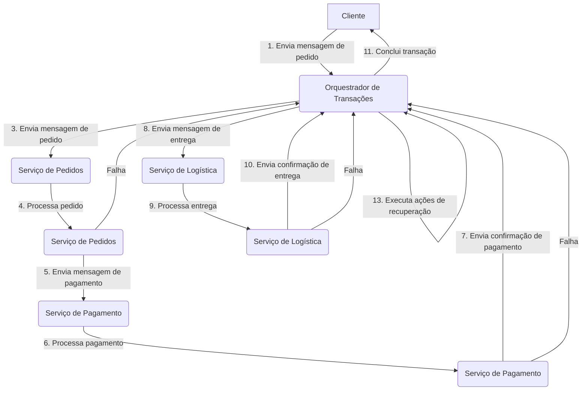
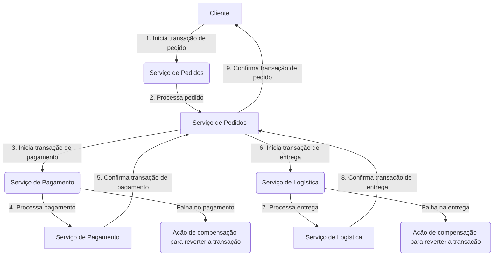
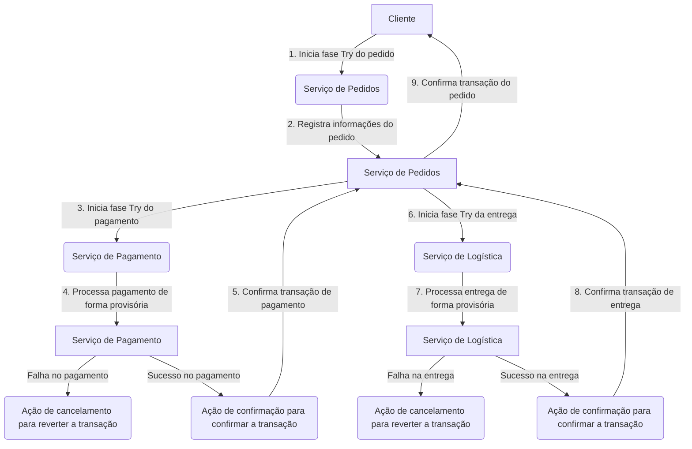
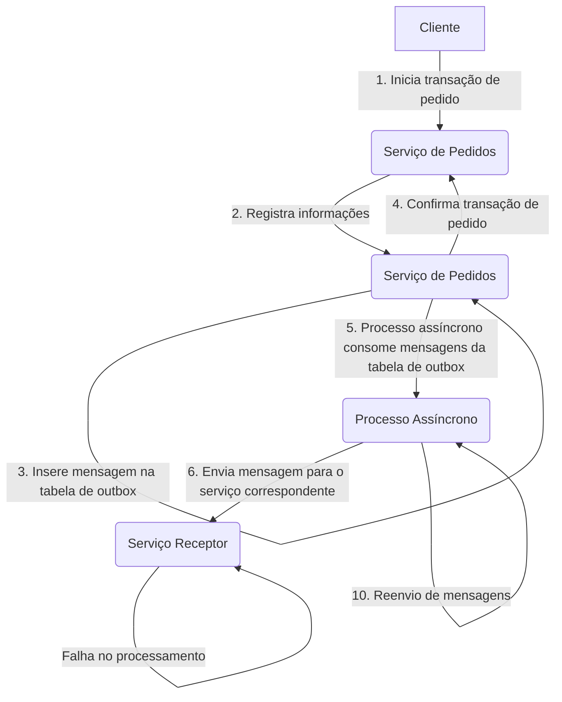

# Padrões e Exemplos

As transações distribuídas são operações que envolvem múltiplos sistemas ou recursos distribuídos, garantindo a consistência dos dados em um ambiente distribuído. Diferentes componentes podem residir em sistemas separados, como bancos de dados, serviços web ou outros sistemas distribuídos. Nesse contexto, existem diversos padrões utilizados para implementar transações distribuídas, cada um com suas características e abordagens específicas. Neste tópico, exploraremos os principais padrões, forneceremos exemplos com os passos a serem seguidos em cada um deles e também abordaremos a utilização de um orquestrador para coordenar as transações.


## Como escolher uma forma de transação distribuída (TCC, SAGA, 2PC, compensação, consistência eventual baseada em mensagens, etc.)


## Várias formas de transações distribuídas
Existem muitas formas convencionais de transações distribuídas, incluindo:

* Transação distribuída com base em mensagem;
* Transação distribuída baseada em compensação (formulário de compensação automática gts/seata);
* Transação distribuída baseada em TCC;
* Transações distribuídas baseadas em SAGA;
* Transação distribuída baseada em 2PC;

A razão pela qual existem tantos formas é *porque não há bala de prata para nada, apenas a solução mais adequada para a cena atual*.

Os princípios dessas formas foram analisados ​​em muitos documentos. Esta documentação se concentrará em como escolher a distribuição correspondente de acordo a forma do negócio.


## Quando escolher transações autônomas?

Quando as condições permitirem, devemos usar transações autônomas o máximo possível, porque em transações autônomas não há necessidade de coordenar outras fontes de dados, o que reduz o consumo de tempo de interação da rede e consumo de IO de armazenamento necessário para coordenação. No caso de modificar a mesma quantidade de dados de negócios, as transações autônomas terão maior desempenho.

No entanto, depois que o banco de dados autônomo é dividido verticalmente devido a fatores como desacoplamento da lógica de negócios, ou o banco de dados é dividido horizontalmente devido a fatores como pressão de desempenho do banco de dados autônomo, os dados são distribuídos em vários bancos de dados. Para coordenar as alterações, você precisa introduzir transações distribuídas.

Existem muitos formas de transações distribuídas, então como escolher a forma que se adequa ao negócio? A seguir, analisaremos algumas formas que podem ser implementadas.


## Padrões de Transações Distribuídas

Aqui estão os principais padrões de transações distribuídas, com suas vantagens e desvantagens em relação a diferentes aspectos:

### 1. Transação Distribuída com Base em Mensagem

Nesse tipo de transação distribuída, as operações são executadas por meio de troca de mensagens assíncronas entre os diferentes participantes do sistema distribuído. Cada participante recebe uma mensagem indicando a operação a ser realizada e, ao concluir a operação com sucesso, envia uma confirmação ao remetente. Essa abordagem permite uma comunicação flexível entre os participantes e é especialmente útil em sistemas distribuídos heterogêneos.

:::tip Vantagens:
- Flexibilidade na comunicação entre os participantes.
- Capacidade de lidar com sistemas heterogêneos.
- Tolerância a falhas por meio de confirmações e tratamento de mensagens de erro.
:::

:::caution Desvantagens:
- Complexidade adicional na coordenação das mensagens.
- Possibilidade de mensagens serem perdidas ou entregues fora de ordem.
- Necessidade de implementar mecanismos de tratamento de falhas e reenvio de mensagens.
:::

Exemplo: Pedido de um cliente que fez o pagamento e aguarda a entrega.

```css
Algoritmo:

1. O cliente envia uma mensagem de pedido contendo os detalhes da compra para o orquestrador de transações.
2. O orquestrador de transações recebe a mensagem e registra a transação.
3. O orquestrador de transações envia uma mensagem de pedido ao serviço de pedidos.
4. O serviço de pedidos processa o pedido e, em caso de sucesso, envia uma mensagem de pagamento ao serviço de pagamento.
5. O serviço de pagamento processa o pagamento e, em caso de sucesso, envia uma confirmação de pagamento ao orquestrador de transações.
6. O orquestrador de transações recebe a confirmação de pagamento e envia uma mensagem de entrega ao serviço de logística.
7. O serviço de logística processa a entrega e, em caso de sucesso, envia uma confirmação de entrega ao orquestrador de transações.
8. O orquestrador de transações recebe a confirmação de entrega e conclui a transação.
9. Em caso de falhas durante qualquer etapa, o serviço correspondente reporta a falha ao orquestrador de transações.
10. O orquestrador de transações toma as ações necessárias, como reenvio de mensagens, execução de ações de compensação ou cancelamento da transação.
```



:::danger Considerando casos de falha:

- Se ocorrer uma falha durante o processamento do pedido pelo serviço de pedidos, o orquestrador de transações pode enviar uma mensagem de cancelamento para todos os participantes envolvidos, revertendo a transação.
- Se ocorrer uma falha durante o processamento do pagamento pelo serviço de pagamento, o orquestrador de transações pode enviar uma mensagem de cancelamento para todos os participantes envolvidos, revertendo a transação.
- Se ocorrer uma falha durante o processamento da entrega pelo serviço de logística, o orquestrador de transações pode enviar uma mensagem de cancelamento para todos os participantes envolvidos, revertendo a transação.

Ao lidar com casos de falha, é importante implementar mecanismos de reenvio de mensagens e tratamento de falhas para garantir a consistência e a integridade da transação distribuída.
:::

### 2. Transação Distribuída Baseada em Compensação

Esse tipo de transação distribuída utiliza um mecanismo de compensação para reverter as operações já executadas em caso de falha. Quando ocorre uma falha, o sistema executa automaticamente a compensação para desfazer as operações anteriores e garantir a consistência dos dados. Existem diferentes abordagens de compensação, como formulário de compensação automática (GTS/Seata), em que as ações de compensação são definidas de forma automática e configurável.

:::tip Vantagens:
- Controle sobre o processo de compensação em caso de falha.
- Capacidade de desfazer operações anteriores de forma automática.
- Maior tolerância a falhas em sistemas distribuídos.
:::

:::caution Desvantagens:
- Complexidade adicional na implementação das lógicas de compensação.
- Possibilidade de operações intermediárias não serem desfeitas corretamente.
- Necessidade de sincronização entre as operações principais e as operações de compensação.
:::

Exemplo: Pedido de um cliente que fez o pagamento e aguarda a entrega.

```css
Algoritmo:

1. O cliente inicia a transação de pedido.
2. O serviço de pedidos recebe o pedido e registra as informações.
3. O serviço de pedidos inicia a transação de pagamento.
4. O serviço de pagamento processa o pagamento.
5. Se ocorrer uma falha durante o processamento do pagamento, o serviço de pagamento executa uma ação de compensação para reverter a transação.
6. Caso contrário, o serviço de pagamento confirma a transação de pagamento.
7. O serviço de pedidos inicia a transação de entrega.
8. O serviço de logística processa a entrega.
9. Se ocorrer uma falha durante o processamento da entrega, o serviço de logística executa uma ação de compensação para reverter a transação.
10. Caso contrário, o serviço de logística confirma a transação de entrega.
11. O serviço de pedidos confirma a transação de pedido.
```



### 3. Transação Distribuída Baseada em TCC (Try-Confirm-Cancel)

A abordagem de transação distribuída baseada em TCC utiliza três fases (tentativa, confirmação e cancelamento) para coordenar a execução das transações. Ela oferece garantia de atomicidade e a capacidade de lidar com falhas e compensações. No entanto, a implementação pode ser complexa devido à coordenação das três fases e à necessidade de um mecanismo de registro de estados.

:::tip Vantagens:
- Controle preciso das operações por meio das fases Try, Confirm e Cancel.
- Capacidade de desfazer operações anteriores de forma granular.
- Flexibilidade em caso de falhas, permitindo diferentes ações de compensação para cada etapa.
- Suporte a integridade transacional mesmo em sistemas distribuídos complexos.
:::

:::caution Desvantagens:
- Complexidade adicional na implementação das três fases (Try, Confirm e Cancel).
- Possibilidade de estados inconsistentes durante a fase Try.
- Necessidade de sincronização entre as fases para manter a consistência transacional.
:::

Exemplo: Pedido de um cliente que fez o pagamento e aguarda a entrega.

```css
Algoritmo:

1. O cliente inicia a fase "Try" do pedido.
2. O serviço de pedidos registra as informações do pedido de forma provisória.
3. O cliente inicia a fase "Try" do pagamento.
4. O serviço de pagamento processa o pagamento de forma provisória.
5. Se ocorrer uma falha durante o processamento do pagamento, o serviço de pagamento inicia a fase "Cancel" para reverter a transação.
6. Caso contrário, o serviço de pagamento inicia a fase "Confirm" para confirmar a transação de pagamento.
7. O cliente inicia a fase "Try" da entrega.
8. O serviço de logística processa a entrega de forma provisória.
9. Se ocorrer uma falha durante o processamento da entrega, o serviço de logística inicia a fase "Cancel" para reverter a transação.
10. Caso contrário, o serviço de logística inicia a fase "Confirm" para confirmar a transação de entrega.
11. O cliente confirma a transação do pedido.
```



:::danger Considerando casos de falha:

- Se ocorrer uma falha durante a fase "Try" do pedido, o serviço de pedidos pode iniciar a fase "Cancel" para reverter a transação.
- Se ocorrer uma falha durante a fase "Try" do pagamento, o serviço de pagamento pode iniciar a fase "Cancel" para reverter a transação.
- Se ocorrer uma falha durante a fase "Try" da entrega, o serviço de logística pode iniciar a fase "Cancel" para reverter a transação.

Ao lidar com casos de falha, é importante implementar mecanismos de reenvio de mensagens e tratamento de falhas para garantir a consistência e a integridade da transação distribuída.
```

### 4. Transações Distribuídas Baseadas em SAGA

As transações distribuídas baseadas em SAGA utilizam um conjunto de passos independentes para executar uma transação distribuída. Essa abordagem oferece flexibilidade na execução e capacidade de lidar com falhas parciais. No entanto, a coordenação dos diferentes passos e a possibilidade de inconsistências de dados são desafios a serem considerados.


:::tip Vantagens:
- Flexibilidade e tolerância a falhas em sistemas distribuídos complexos.
- Coordenação descentralizada entre os participantes, evitando um ponto central de controle.
- Suporte a operações paralelas e assíncronas em diferentes etapas da transação.
:::

:::caution Desvantagens:
- Complexidade adicional na implementação e coordenação das etapas de SAGA.
- Possibilidade de estados inconsistentes entre as etapas em caso de falha.
- Necessidade de lógicas de compensação bem definidas para reverter operações anteriores.
:::

### 5. Transação Distribuída Baseada em Two-Phase Commit (2PC)

A transação distribuída baseada em 2PC utiliza um coordenador para coordenar a execução das transações entre os participantes. Ela oferece garantia de atomicidade e a capacidade de lidar com falhas de participantes. No entanto, o bloqueio de recursos e a possibilidade de bloqueio prolongado são aspectos a serem considerados.

:::tip Vantagens:
- Garantia de atomicidade e consistência transacional em sistemas distribuídos.
- Coordenação centralizada pelo coordenador para controlar a confirmação das transações.
- Suporte a transações em larga escala envolvendo múltiplos participantes.
:::

:::caution Desvantagens:
- Dependência de um coordenador central, o que pode resultar em gargalos de desempenho.
- Possibilidade de bloqueio de recursos durante a execução do protocolo 2PC.
- Falhas no coordenador podem levar a impasses e problemas de escalabilidade.
:::


### 6. Transação Distribuída Baseada em Choreography-Based Saga

:::tip Vantagens:
- Autonomia e baixa acoplamento entre os participantes da transação.
- Menor dependência de um coordenador central, permitindo uma escalabilidade melhor.
- Suporte a comunicação direta entre os participantes para avançar ou reverter a transação.
:::

:::caution Desvantagens:
- Dificuldade em lidar com cenários complexos e falhas em sistemas distribuídos.
- Maior complexidade na coordenação das mensagens entre os participantes.
- Possibilidade de comunicação assíncrona entre os participantes resultar em estados inconsistentes.
:::

### 7. Transação Distribuída Baseada em Transactional Outbox

A ideia principal é usar uma tabela especial chamada Transactional Outbox para armazenar os eventos ou mensagens que devem ser enviados como parte da transação. Essa tabela faz parte do banco de dados transacional e registra os eventos ou mensagens em uma transação juntamente com as outras operações de modificação de dados.

Quando uma transação é confirmada, os eventos ou mensagens registrados no Transactional Outbox são processados e enviados para os respectivos destinos. Isso ocorre em um momento posterior, após o commit da transação principal.

A abordagem do Transactional Outbox oferece algumas vantagens significativas. Primeiro, ela garante a atomicidade da transação principal e do envio dos eventos ou mensagens. Se houver um erro ou falha no envio, os eventos não serão perdidos, pois serão reprocessados posteriormente.

Além disso, essa abordagem elimina a necessidade de usar mecanismos complexos de duas fases ou compensação. Em vez disso, as mensagens são enviadas de forma assíncrona após o commit da transação, garantindo uma melhor escalabilidade e desempenho do sistema.

No entanto, é importante notar que o uso do Transactional Outbox também apresenta alguns desafios. A principal consideração é a necessidade de implementar um processo de leitura e envio dos eventos ou mensagens armazenados no Transactional Outbox de forma assíncrona e confiável, garantindo a entrega correta e ordenada.

:::tip Vantagens:
- Garantia de atomicidade na transação, mesmo em caso de falhas durante o envio de mensagens.
- Desempenho aprimorado, pois as operações relacionadas às mensagens são realizadas de forma assíncrona.
- Menor acoplamento entre os serviços participantes da transação.
:::

:::caution Desvantagens:
- Complexidade adicional na implementação e gerenciamento da tabela de "outbox".
- Necessidade de um processo assíncrono para consumir as mensagens e enviá-las para os serviços correspondentes.
- Possibilidade de falhas na entrega das mensagens e necessidade de mecanismos de reenvio e tratamento de falhas.
:::

Exemplo: Pedido de um cliente que fez o pagamento e aguarda a entrega.

```css
Algoritmo:

1. O cliente inicia a transação de pedido.
2. O serviço de pedidos recebe o pedido e registra as informações.
3. O serviço de pedidos insere uma mensagem na tabela de "outbox" contendo os detalhes da transação.
4. O serviço de pedidos confirma a transação do pedido.
5. Um processo assíncrono consome as mensagens da tabela de "outbox".
6. Para cada mensagem na tabela de "outbox", o processo assíncrono envia a mensagem para o serviço correspondente.
7. O serviço receptor processa a mensagem e executa a operação relacionada.
8. Em caso de falhas durante o envio das mensagens, um mecanismo de reenvio é acionado para garantir a entrega.
9. O serviço receptor confirma a conclusão da operação.
10. Em caso de falhas durante o processamento da operação, um mecanismo de tratamento de falhas é acionado.
```


### Conclusão

As transações distribuídas são fundamentais para garantir a consistência dos dados em sistemas distribuídos. Cada padrão de transação distribuída apresenta vantagens e desvantagens em relação a diferentes aspectos, como controle, desempenho e complexidade. A escolha do padrão adequado dependerá das necessidades e requisitos específicos do sistema em questão.

Ao compreender os diferentes padrões, como transação distribuída com base em mensagem, transação distribuída baseada em compensação, transação distribuída baseada em TCC, transações distribuídas baseadas em SAGA, transação distribuída baseada em Two-Phase Commit, transação distribuída baseada em Choreography-Based Saga e transação distribuída baseada em Transactional Outbox, é possível projetar e implementar sistemas distribuídos robustos e confiáveis.

É importante considerar as características específicas de cada cenário, como a complexidade do sistema, a tolerância a falhas desejada, o desempenho necessário e a escalabilidade esperada, para escolher o padrão mais adequado.